# Playing with the params

Playing with the params attempts to understand the implications of varying the hyperparameters of a model. Since our objective here is to understand how the tweaking of the params affects the model, We try to maintain the basic architecture of the CNN network with the following param specifications.  
  
## Model Specifications  
  
Type of network -       Convolutional Neural Network  
Feature scaled values - 0 to 1  
Number of layers -      6 to 10
Filter Size -           3x3 / 2x2  
Padding -               SAME (preserving the dimension across convolution operations)  
Stride -                1 
Activation -            Relu (Rectified Linear Unit - values clipped at a minimum of 0)  
Loss Function -         Cross Entropy  
Optimizer -             SGD with Momentum(0.9)
Regularizer -           Maxnorm Constraint (value clipped at 3 as this reported better perfromance , also to avoid gradient saturation.                         We will later see how using too much regularization has the penalizing effect on the model).  
  
  
###### The code for all the models can be found in the [models](https://github.com/kashyam/Playing_with_params/tree/master/models)
  
   
   
## Model_1 (Base Model)
  
In the Base Model We have trained with the following parameter specifications. With inadequate regularization the model has turned out to be overfit. The gap between the Train/Val accuracies and losses can be clearly seen in the graph which gives us clear idea of what should be done to generalize the model.  
  
###### Hyperparameters  
epochs = 25  
lrate = 0.01  
Droupout = 0.2  
Batchnorm = Not Applied  
Kernel Regularizer = Not Applied  
  
###### Accuracy
Train Accuracy - 81.82  
Val Accuracy   - 65.72  

```
# Simple CNN model for the CIFAR-10 Dataset
# MOdel Definition
model = Sequential()
model.add(Conv2D(32, (3, 3), input_shape=(32, 32,3), padding='same', activation='relu', kernel_constraint=maxnorm(3)))
model.add(Dropout(0.2))
model.add(Conv2D(32, (3, 3), activation='relu', padding='same', kernel_constraint=maxnorm(3)))
model.add(MaxPool2D(pool_size=(2, 2)))
model.add(Conv2D(64, (3, 3), input_shape=(32, 32,3), padding='same', activation='relu', kernel_constraint=maxnorm(3)))
model.add(Dropout(0.2))
model.add(Conv2D(64, (3, 3), activation='relu', padding='same', kernel_constraint=maxnorm(3)))
model.add(MaxPool2D(pool_size=(2, 2)))
model.add(Conv2D(128, (3, 3), input_shape=(32, 32,3), padding='same', activation='relu', kernel_constraint=maxnorm(3)))
model.add(Dropout(0.2))
model.add(Conv2D(128, (3, 3), activation='relu', padding='same', kernel_constraint=maxnorm(3)))
model.add(MaxPool2D(pool_size=(2, 2)))
model.add(Conv2D(1024, (2, 2), strides=2, activation='relu', padding='valid', kernel_constraint=maxnorm(3)))
model.add(Flatten())
model.add(Dense(num_classes, activation='softmax'))
print(model.summary())

# Compile model
epochs = 25
lrate = 0.01
decay = lrate/epochs
sgd = SGD(lr=lrate, momentum=0.9, decay=decay, nesterov=False)
model.compile(loss='categorical_crossentropy', optimizer=sgd, metrics=['accuracy'])

# Fit the model
seqModel = model.fit(X_train, y_train, validation_data=(X_test, y_test), epochs=epochs, batch_size=256, verbose=2)


```

    _________________________________________________________________
    Layer (type)                 Output Shape              Param #   
    =================================================================
    conv2d_7 (Conv2D)            (None, 32, 32, 32)        896       
    _________________________________________________________________
    dropout_4 (Dropout)          (None, 32, 32, 32)        0         
    _________________________________________________________________
    conv2d_8 (Conv2D)            (None, 32, 32, 32)        9248      
    _________________________________________________________________
    max_pooling2d_4 (MaxPooling2 (None, 16, 16, 32)        0         
    _________________________________________________________________
    conv2d_9 (Conv2D)            (None, 16, 16, 64)        18496     
    _________________________________________________________________
    dropout_5 (Dropout)          (None, 16, 16, 64)        0         
    _________________________________________________________________
    conv2d_10 (Conv2D)           (None, 16, 16, 64)        36928     
    _________________________________________________________________
    max_pooling2d_5 (MaxPooling2 (None, 8, 8, 64)          0         
    _________________________________________________________________
    conv2d_11 (Conv2D)           (None, 8, 8, 128)         73856     
    _________________________________________________________________
    dropout_6 (Dropout)          (None, 8, 8, 128)         0         
    _________________________________________________________________
    conv2d_12 (Conv2D)           (None, 8, 8, 128)         147584    
    _________________________________________________________________
    max_pooling2d_6 (MaxPooling2 (None, 4, 4, 128)         0         
    _________________________________________________________________
    conv2d_13 (Conv2D)           (None, 2, 2, 1024)        525312    
    _________________________________________________________________
    flatten_1 (Flatten)          (None, 4096)              0         
    _________________________________________________________________
    dense_1 (Dense)              (None, 10)                40970     
    =================================================================
    Total params: 853,290
    Trainable params: 853,290
    Non-trainable params: 0
    _________________________________________________________________
    None
    Train on 50000 samples, validate on 10000 samples
    Epoch 20/25
     - 30s - loss: 0.6918 - acc: 0.7579 - val_loss: 1.0063 - val_acc: 0.6565
    Epoch 21/25
     - 29s - loss: 0.6581 - acc: 0.7695 - val_loss: 1.0234 - val_acc: 0.6584
    Epoch 22/25
     - 30s - loss: 0.6187 - acc: 0.7833 - val_loss: 1.0577 - val_acc: 0.6552
    Epoch 23/25
     - 30s - loss: 0.5800 - acc: 0.7969 - val_loss: 1.0224 - val_acc: 0.6642
    Epoch 24/25
     - 30s - loss: 0.5529 - acc: 0.8049 - val_loss: 1.0351 - val_acc: 0.6544
    Epoch 25/25
     - 30s - loss: 0.5143 - acc: 0.8182 - val_loss: 1.0829 - val_acc: 0.6576
    10000/10000 [==============================] - 4s 392us/step
    Train Accuracy: 65.760000
    Train loss: 1.8292010


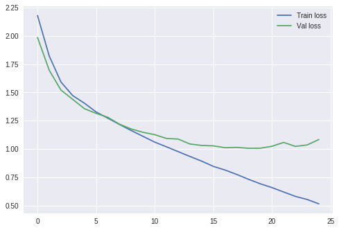


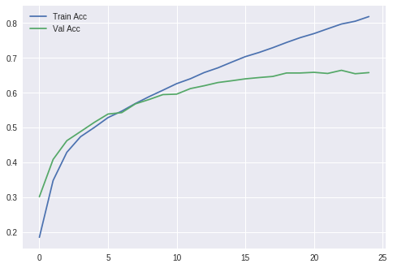
  
  
  
  
## Model_2 ( Dropout = 0.4 )  
  
Since the base model showed tendency of variance, We try to generalize the model by increasing the dropout rate to 0.4 from 0.2. We could see the effect in the graph that the gap beween the training and validation curves have decreased.  
  
###### Hyperparameters
epochs = 25  
lrate = 0.01  
Droupout = 0.4  
Batchnorm = Not Applied  
Kernel Regularizer = Not Applied  
  
###### Accuracy
Train Accuracy - 83.12  
Val Accuracy   - 76.45  
  
  
```python

# Create the model
model = Sequential()
model.add(Conv2D(32, (3, 3), input_shape=(32, 32,3), padding='same', activation='relu', kernel_constraint=maxnorm(3)))
model.add(Dropout(0.4))
model.add(BatchNormalization())
model.add(Conv2D(32, (3, 3), activation='relu', padding='same', kernel_constraint=maxnorm(3)))
model.add(MaxPool2D(pool_size=(2, 2)))
model.add(Conv2D(64, (3, 3), input_shape=(32, 32,3), padding='same', activation='relu', kernel_constraint=maxnorm(3)))
model.add(Dropout(0.4))
model.add(BatchNormalization())
model.add(Conv2D(64, (3, 3), activation='relu', padding='same', kernel_constraint=maxnorm(3)))
model.add(MaxPool2D(pool_size=(2, 2)))
model.add(Conv2D(128, (3, 3), input_shape=(32, 32,3), padding='same', activation='relu', kernel_constraint=maxnorm(3)))
model.add(Dropout(0.4))
model.add(BatchNormalization())
model.add(Conv2D(128, (3, 3), activation='relu', padding='same', kernel_constraint=maxnorm(3)))
model.add(MaxPool2D(pool_size=(2, 2)))
model.add(Conv2D(1024, (2, 2), strides=2, activation='relu', padding='valid', kernel_constraint=maxnorm(3)))
#model.add(Conv2D(10, (2, 2), activation='relu'))
#model.add(Conv2D(10, (1,1), activation='relu'))
model.add(Flatten())
model.add(Dense(num_classes, activation='softmax'))
print(model.summary())

# Compile model
epochs = 25
lrate = 0.01
decay = lrate/epochs
sgd = SGD(lr=lrate, momentum=0.9, decay=decay, nesterov=False)
model.compile(loss='categorical_crossentropy', optimizer=sgd, metrics=['accuracy']

# Fit the model
seqModel = model.fit(X_train, y_train, validation_data=(X_test, y_test), epochs=epochs, batch_size=256, verbose=2)

```

    _________________________________________________________________
    Layer (type)                 Output Shape              Param #   
    =================================================================
    conv2d_15 (Conv2D)           (None, 32, 32, 32)        896       
    _________________________________________________________________
    dropout_8 (Dropout)          (None, 32, 32, 32)        0         
    _________________________________________________________________
    batch_normalization_1 (Batch (None, 32, 32, 32)        128       
    _________________________________________________________________
    conv2d_16 (Conv2D)           (None, 32, 32, 32)        9248      
    _________________________________________________________________
    max_pooling2d_7 (MaxPooling2 (None, 16, 16, 32)        0         
    _________________________________________________________________
    conv2d_17 (Conv2D)           (None, 16, 16, 64)        18496     
    _________________________________________________________________
    dropout_9 (Dropout)          (None, 16, 16, 64)        0         
    _________________________________________________________________
    batch_normalization_2 (Batch (None, 16, 16, 64)        256       
    _________________________________________________________________
    conv2d_18 (Conv2D)           (None, 16, 16, 64)        36928     
    _________________________________________________________________
    max_pooling2d_8 (MaxPooling2 (None, 8, 8, 64)          0         
    _________________________________________________________________
    conv2d_19 (Conv2D)           (None, 8, 8, 128)         73856     
    _________________________________________________________________
    dropout_10 (Dropout)         (None, 8, 8, 128)         0         
    _________________________________________________________________
    batch_normalization_3 (Batch (None, 8, 8, 128)         512       
    _________________________________________________________________
    conv2d_20 (Conv2D)           (None, 8, 8, 128)         147584    
    _________________________________________________________________
    max_pooling2d_9 (MaxPooling2 (None, 4, 4, 128)         0         
    _________________________________________________________________
    conv2d_21 (Conv2D)           (None, 2, 2, 1024)        525312    
    _________________________________________________________________
    flatten_2 (Flatten)          (None, 4096)              0         
    _________________________________________________________________
    dense_2 (Dense)              (None, 10)                40970     
    =================================================================
    Total params: 854,186
    Trainable params: 853,738
    Non-trainable params: 448
    _________________________________________________________________
    None
    Train on 50000 samples, validate on 10000 samples
    Epoch 20/25
     - 17s - loss: 0.5516 - acc: 0.8072 - val_loss: 0.6694 - val_acc: 0.7693
    Epoch 21/25
     - 17s - loss: 0.5335 - acc: 0.8122 - val_loss: 0.6749 - val_acc: 0.7642
    Epoch 22/25
     - 17s - loss: 0.5210 - acc: 0.8175 - val_loss: 0.6506 - val_acc: 0.7769
    Epoch 23/25
     - 17s - loss: 0.5056 - acc: 0.8214 - val_loss: 0.6712 - val_acc: 0.7730
    Epoch 24/25
     - 17s - loss: 0.4908 - acc: 0.8268 - val_loss: 0.6888 - val_acc: 0.7654
    Epoch 25/25
     - 17s - loss: 0.4790 - acc: 0.8312 - val_loss: 0.6920 - val_acc: 0.7645
    10000/10000 [==============================] - 2s 182us/step
    Train Accuracy: 76.450000
    Train loss: 69.204978  
      

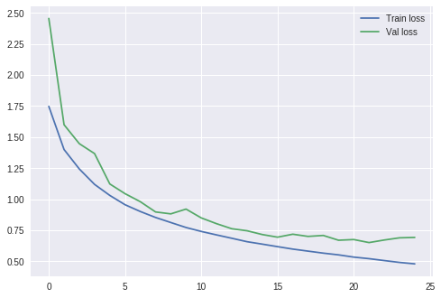


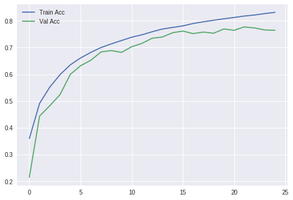  
  
  
  
  
## Model_3 ( Batchnorm with Dropout = 0.2 )
  
Now that We have tried reducing the variance by increasing the drouout rate. Let's see how adding a BatchNorm to the model performs with the old Dropout rate of 0.2. We can understand from below that Batchnorm has profound effect on the model. Althought it has has a regularization effect this has helped our model performance by increasing the accuracies. The train accuracy has crossed 90 and the Val accuracy has crossed 80 still **our model suffers from the overfit problem**.
  
  
###### Advantages of BatchNorm  
Improves gradient flow, used on very deep models (Resnet predominantly uses BatchNorm).  
Allow higher learning rates.  
Reduce dependency on initialization.  
Has some kind of regularization (Even make Dropout less important but keep using it).  
  
###### Hyperparameters
epochs = 25  
lrate = 0.01  
Droupout = 0.2 
Batchnorm = Yes
Kernel Regularizer = Not Applied  
  
###### Accuracy
Train Accuracy - 92.31  
Val Accuracy   - 81.01  
  
  
```python

# Create the model
model = Sequential()
model.add(Conv2D(32, (3, 3), input_shape=(32, 32,3), padding='same', activation='relu', kernel_constraint=maxnorm(3)))
model.add(Dropout(0.2))
model.add(BatchNormalization())
model.add(Conv2D(32, (3, 3), activation='relu', padding='same', kernel_constraint=maxnorm(3)))
model.add(MaxPool2D(pool_size=(2, 2)))
model.add(Conv2D(64, (3, 3), input_shape=(32, 32,3), padding='same', activation='relu', kernel_constraint=maxnorm(3)))
model.add(Dropout(0.2))
model.add(BatchNormalization())
model.add(Conv2D(64, (3, 3), activation='relu', padding='same', kernel_constraint=maxnorm(3)))
model.add(MaxPool2D(pool_size=(2, 2)))
model.add(Conv2D(128, (3, 3), input_shape=(32, 32,3), padding='same', activation='relu', kernel_constraint=maxnorm(3)))
model.add(Dropout(0.2))
model.add(BatchNormalization())
model.add(Conv2D(128, (3, 3), activation='relu', padding='same', kernel_constraint=maxnorm(3)))
model.add(MaxPool2D(pool_size=(2, 2)))
model.add(Conv2D(1024, (2, 2), strides=2, activation='relu', padding='valid', kernel_constraint=maxnorm(3)))
model.add(Flatten())
model.add(Dense(num_classes, activation='softmax'))
print(model.summary())

# Compile model
epochs = 25
lrate = 0.01
decay = lrate/epochs
sgd = SGD(lr=lrate, momentum=0.9, decay=decay, nesterov=False)
model.compile(loss='categorical_crossentropy', optimizer=sgd, metrics=['accuracy'])

# Fit the model
seqModel = model.fit(X_train, y_train, validation_data=(X_test, y_test), epochs=epochs, batch_size=256, verbose=2)

```

    _________________________________________________________________
    Layer (type)                 Output Shape              Param #   
    =================================================================
    conv2d_22 (Conv2D)           (None, 32, 32, 32)        896       
    _________________________________________________________________
    dropout_11 (Dropout)         (None, 32, 32, 32)        0         
    _________________________________________________________________
    batch_normalization_4 (Batch (None, 32, 32, 32)        128       
    _________________________________________________________________
    conv2d_23 (Conv2D)           (None, 32, 32, 32)        9248      
    _________________________________________________________________
    max_pooling2d_10 (MaxPooling (None, 16, 16, 32)        0         
    _________________________________________________________________
    conv2d_24 (Conv2D)           (None, 16, 16, 64)        18496     
    _________________________________________________________________
    dropout_12 (Dropout)         (None, 16, 16, 64)        0         
    _________________________________________________________________
    batch_normalization_5 (Batch (None, 16, 16, 64)        256       
    _________________________________________________________________
    conv2d_25 (Conv2D)           (None, 16, 16, 64)        36928     
    _________________________________________________________________
    max_pooling2d_11 (MaxPooling (None, 8, 8, 64)          0         
    _________________________________________________________________
    conv2d_26 (Conv2D)           (None, 8, 8, 128)         73856     
    _________________________________________________________________
    dropout_13 (Dropout)         (None, 8, 8, 128)         0         
    _________________________________________________________________
    batch_normalization_6 (Batch (None, 8, 8, 128)         512       
    _________________________________________________________________
    conv2d_27 (Conv2D)           (None, 8, 8, 128)         147584    
    _________________________________________________________________
    max_pooling2d_12 (MaxPooling (None, 4, 4, 128)         0         
    _________________________________________________________________
    conv2d_28 (Conv2D)           (None, 2, 2, 1024)        525312    
    _________________________________________________________________
    flatten_3 (Flatten)          (None, 4096)              0         
    _________________________________________________________________
    dense_3 (Dense)              (None, 10)                40970     
    =================================================================
    Total params: 854,186
    Trainable params: 853,738
    Non-trainable params: 448
    _________________________________________________________________
    None
    Train on 50000 samples, validate on 10000 samples

    Epoch 20/25
     - 17s - loss: 0.2930 - acc: 0.8991 - val_loss: 0.5903 - val_acc: 0.8127
    Epoch 21/25
     - 17s - loss: 0.2743 - acc: 0.9055 - val_loss: 0.5931 - val_acc: 0.8076
    Epoch 22/25
     - 17s - loss: 0.2661 - acc: 0.9070 - val_loss: 0.6059 - val_acc: 0.8067
    Epoch 23/25
     - 17s - loss: 0.2487 - acc: 0.9144 - val_loss: 0.5761 - val_acc: 0.8164
    Epoch 24/25
     - 17s - loss: 0.2369 - acc: 0.9191 - val_loss: 0.5900 - val_acc: 0.8141
    Epoch 25/25
     - 17s - loss: 0.2232 - acc: 0.9231 - val_loss: 0.6041 - val_acc: 0.8101
    10000/10000 [==============================] - 2s 182us/step
    Train Accuracy: 81.010000
    Train loss: 60.405836


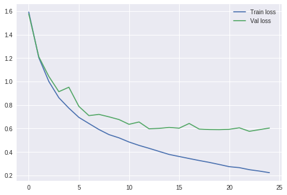


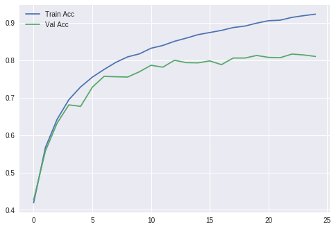  
  
  
  
  
## Model_4 ( Batchnorm Without Dropout )
  
  
We saw that batchnorm boosted the model performance by a huge margin but could not reduce the overfit. Also we were able to see the increased accuracies compared to the previous models. Now When we try to train the same model without dropout, the model tends to gain an accuracy of 100% during test while severly performing during the validation time. This is perfect example of the overfit model, where it has **morised the training data failing to generalize on the data the model hasn't seen**. This guides us that we have enough learning tendency but needed to be regularized. The train loss has reduced while the Val loss has increased. This could be well understood if we compore the loss_graph of model_3 and model_4. From the below loss comparison we can understand that the model is more prone to overfit without regularizing, showing a tendency of **reduced train loss and increased validation loss**. Hence regularization is an important aspect of any neural network model.
  
  
###### Loss comparison between Model_2 and Model_3
Model_3 - Train Loss: 0.2232  val_loss: 0.6041
Model_4 - Train Loss: 0.0041  val_loss: 0.9352  
  
###### Hyperparameters
epochs = 25  
lrate = 0.01  
Droupout = 0.4
Batchnorm = Yes
Kernel Regularizer = Not Applied  
  
###### Accuracy
Train Accuracy - 100.00  
Val Accuracy   - 79.67  
  
  
  
```python

# Create the model
model = Sequential()
model.add(Conv2D(32, (3, 3), input_shape=(32, 32,3), padding='same', activation='relu', kernel_constraint=maxnorm(3)))
model.add(BatchNormalization())
model.add(Conv2D(32, (3, 3), activation='relu', padding='same', kernel_constraint=maxnorm(3)))
model.add(MaxPool2D(pool_size=(2, 2)))
model.add(Conv2D(64, (3, 3), input_shape=(32, 32,3), padding='same', activation='relu', kernel_constraint=maxnorm(3)))
model.add(BatchNormalization())
model.add(Conv2D(64, (3, 3), activation='relu', padding='same', kernel_constraint=maxnorm(3)))
model.add(MaxPool2D(pool_size=(2, 2)))
model.add(Conv2D(128, (3, 3), input_shape=(32, 32,3), padding='same', activation='relu', kernel_constraint=maxnorm(3)))
model.add(BatchNormalization())
model.add(Conv2D(128, (3, 3), activation='relu', padding='same', kernel_constraint=maxnorm(3)))
model.add(MaxPool2D(pool_size=(2, 2)))
model.add(Conv2D(1024, (2, 2), strides=2, activation='relu', padding='valid', kernel_constraint=maxnorm(3)))
model.add(Flatten())
model.add(Dense(num_classes, activation='softmax'))
print(model.summary())

# Compile model
epochs = 25
lrate = 0.01
decay = lrate/epochs
sgd = SGD(lr=lrate, momentum=0.9, decay=decay, nesterov=False)
model.compile(loss='categorical_crossentropy', optimizer=sgd, metrics=['accuracy'])

# Fit the model
seqModel = model.fit(X_train, y_train, validation_data=(X_test, y_test), epochs=epochs, batch_size=256, verbose=2)

```

    _________________________________________________________________
    Layer (type)                 Output Shape              Param #   
    =================================================================
    conv2d_29 (Conv2D)           (None, 32, 32, 32)        896       
    _________________________________________________________________
    batch_normalization_7 (Batch (None, 32, 32, 32)        128       
    _________________________________________________________________
    conv2d_30 (Conv2D)           (None, 32, 32, 32)        9248      
    _________________________________________________________________
    max_pooling2d_13 (MaxPooling (None, 16, 16, 32)        0         
    _________________________________________________________________
    conv2d_31 (Conv2D)           (None, 16, 16, 64)        18496     
    _________________________________________________________________
    batch_normalization_8 (Batch (None, 16, 16, 64)        256       
    _________________________________________________________________
    conv2d_32 (Conv2D)           (None, 16, 16, 64)        36928     
    _________________________________________________________________
    max_pooling2d_14 (MaxPooling (None, 8, 8, 64)          0         
    _________________________________________________________________
    conv2d_33 (Conv2D)           (None, 8, 8, 128)         73856     
    _________________________________________________________________
    batch_normalization_9 (Batch (None, 8, 8, 128)         512       
    _________________________________________________________________
    conv2d_34 (Conv2D)           (None, 8, 8, 128)         147584    
    _________________________________________________________________
    max_pooling2d_15 (MaxPooling (None, 4, 4, 128)         0         
    _________________________________________________________________
    conv2d_35 (Conv2D)           (None, 2, 2, 1024)        525312    
    _________________________________________________________________
    flatten_4 (Flatten)          (None, 4096)              0         
    _________________________________________________________________
    dense_4 (Dense)              (None, 10)                40970     
    =================================================================
    Total params: 854,186
    Trainable params: 853,738
    Non-trainable params: 448
    _________________________________________________________________
    None
    Train on 50000 samples, validate on 10000 samples
    Epoch 20/25
     - 28s - loss: 0.0066 - acc: 1.0000 - val_loss: 0.8943 - val_acc: 0.7987
    Epoch 21/25
     - 28s - loss: 0.0058 - acc: 1.0000 - val_loss: 0.8979 - val_acc: 0.7980
    Epoch 22/25
     - 28s - loss: 0.0053 - acc: 1.0000 - val_loss: 0.9140 - val_acc: 0.7978
    Epoch 23/25
     - 28s - loss: 0.0048 - acc: 1.0000 - val_loss: 0.9215 - val_acc: 0.7950
    Epoch 24/25
     - 28s - loss: 0.0045 - acc: 1.0000 - val_loss: 0.9297 - val_acc: 0.7977
    Epoch 25/25
     - 28s - loss: 0.0041 - acc: 1.0000 - val_loss: 0.9352 - val_acc: 0.7967
    10000/10000 [==============================] - 4s 429us/step
    Train Accuracy: 79.670000
    Train loss: 93.515955


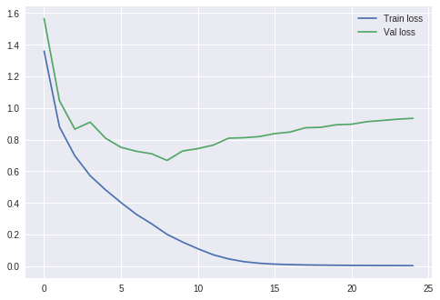


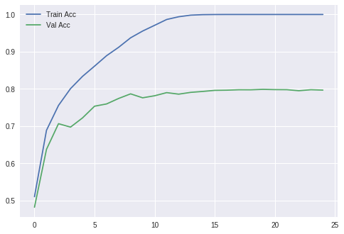  
  
  
  
  
## Model_5 (With increased dropout at the later layers and epochs = 50)
  
  
Model_4 showed widening tendency between the training and Val accuracies despite increase in the performance. Such models will cost us more at the time of inference. Hence we try to drop more neurons along the depth of the model. This serves our purpose by making the model more realistic for inference by converging the train/val curves.  
  
  
###### Hyperparameters
epochs = 50  
lrate = 0.01  
Droupout = 0.3/0.5/0.7  
Batchnorm = Yes  
Kernel Regularizer = Not Applied  
  
###### Accuracy
Train Accuracy - 81.91  
Val Accuracy   - 81.71  
  
  
```python

# Create the model
model = Sequential()
model.add(Conv2D(32, (3, 3), input_shape=(32, 32,3), padding='same', activation='relu', kernel_constraint=maxnorm(3)))
model.add(Dropout(0.3))
model.add(BatchNormalization())
model.add(Conv2D(32, (3, 3), activation='relu', padding='same', kernel_constraint=maxnorm(3)))
model.add(MaxPool2D(pool_size=(2, 2)))
model.add(Conv2D(64, (3, 3), input_shape=(32, 32,3), padding='same', activation='relu', kernel_constraint=maxnorm(3)))
model.add(Dropout(0.5))
model.add(BatchNormalization())
model.add(Conv2D(64, (3, 3), activation='relu', padding='same', kernel_constraint=maxnorm(3)))
model.add(MaxPool2D(pool_size=(2, 2)))
model.add(Conv2D(128, (3, 3), input_shape=(32, 32,3), padding='valid', activation='relu', kernel_constraint=maxnorm(3)))
model.add(Dropout(0.7))
model.add(BatchNormalization())
model.add(Conv2D(256, (3, 3), activation='relu', padding='valid', kernel_constraint=maxnorm(3)))
model.add(MaxPool2D(pool_size=(2, 2)))
model.add(Conv2D(512, (2, 2), activation='relu'))
model.add(Flatten())
model.add(Dense(num_classes, activation='softmax'))
print(model.summary())

# Compile model
epochs = 50
lrate = 0.01
decay = lrate/epochs
sgd = SGD(lr=lrate, momentum=0.9, decay=decay, nesterov=False)
model.compile(loss='categorical_crossentropy', optimizer=sgd, metrics=['accuracy'])

# Fit the model
seqModel = model.fit(X_train, y_train, validation_data=(X_test, y_test), epochs=epochs, batch_size=256, verbose=2)

```

    _________________________________________________________________
    Layer (type)                 Output Shape              Param #   
    =================================================================
    conv2d_95 (Conv2D)           (None, 32, 32, 32)        896       
    _________________________________________________________________
    dropout_38 (Dropout)         (None, 32, 32, 32)        0         
    _________________________________________________________________
    batch_normalization_34 (Batc (None, 32, 32, 32)        128       
    _________________________________________________________________
    conv2d_96 (Conv2D)           (None, 32, 32, 32)        9248      
    _________________________________________________________________
    max_pooling2d_40 (MaxPooling (None, 16, 16, 32)        0         
    _________________________________________________________________
    conv2d_97 (Conv2D)           (None, 16, 16, 64)        18496     
    _________________________________________________________________
    dropout_39 (Dropout)         (None, 16, 16, 64)        0         
    _________________________________________________________________
    batch_normalization_35 (Batc (None, 16, 16, 64)        256       
    _________________________________________________________________
    conv2d_98 (Conv2D)           (None, 16, 16, 64)        36928     
    _________________________________________________________________
    max_pooling2d_41 (MaxPooling (None, 8, 8, 64)          0         
    _________________________________________________________________
    conv2d_99 (Conv2D)           (None, 6, 6, 128)         73856     
    _________________________________________________________________
    dropout_40 (Dropout)         (None, 6, 6, 128)         0         
    _________________________________________________________________
    batch_normalization_36 (Batc (None, 6, 6, 128)         512       
    _________________________________________________________________
    conv2d_100 (Conv2D)          (None, 4, 4, 256)         295168    
    _________________________________________________________________
    max_pooling2d_42 (MaxPooling (None, 2, 2, 256)         0         
    _________________________________________________________________
    conv2d_101 (Conv2D)          (None, 1, 1, 512)         524800    
    _________________________________________________________________
    flatten_13 (Flatten)         (None, 512)               0         
    _________________________________________________________________
    dense_13 (Dense)             (None, 10)                5130      
    =================================================================
    Total params: 965,418
    Trainable params: 964,970
    Non-trainable params: 448
    _________________________________________________________________
    None
    Train on 50000 samples, validate on 10000 samples
    Epoch 45/50
     - 15s - loss: 0.5358 - acc: 0.8099 - val_loss: 0.5674 - val_acc: 0.8051
    Epoch 46/50
     - 15s - loss: 0.5292 - acc: 0.8102 - val_loss: 0.5454 - val_acc: 0.8121
    Epoch 47/50
     - 15s - loss: 0.5240 - acc: 0.8136 - val_loss: 0.5506 - val_acc: 0.8096
    Epoch 48/50
     - 15s - loss: 0.5241 - acc: 0.8138 - val_loss: 0.5345 - val_acc: 0.8136
    Epoch 49/50
     - 15s - loss: 0.5155 - acc: 0.8161 - val_loss: 0.5546 - val_acc: 0.8102
    Epoch 50/50
     - 15s - loss: 0.5126 - acc: 0.8191 - val_loss: 0.5340 - val_acc: 0.8177
    10000/10000 [==============================] - 2s 197us/step
    Train Accuracy: 81.770000
    Train loss: 53.395072


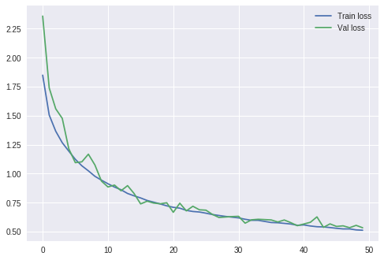


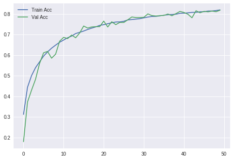  
  
  
  
  
## Model_6 (Higher dropout at earlier layers)
  
  
Introducing dropout in the initial layers has detrimental effects on the model. This can be understood from the graphs that the Val curve looks more jittery because of losing more information lost even before learning any low level features (such as edges). We can understand from this that this practice of dropping neurons in the early layers is not good practice and will increase the loss of the model.
  
  
###### Hyperparameters
epochs = 50 
lrate = 0.01  
Droupout = 0.5/0.5/0.8  
Batchnorm = Yes  
Kernel Regularizer = Not Applied  
  
###### Accuracy
Train Accuracy - 78.90  
Val Accuracy   - 73.84  

```python

# Create the model
model = Sequential()
model.add(Conv2D(32, (3, 3), input_shape=(32, 32,3), padding='same', activation='relu', kernel_constraint=maxnorm(3)))
model.add(Dropout(0.5))
model.add(BatchNormalization())
model.add(Conv2D(32, (3, 3), activation='relu', padding='same', kernel_constraint=maxnorm(3)))
model.add(MaxPool2D(pool_size=(2, 2)))
model.add(Conv2D(64, (3, 3), input_shape=(32, 32,3), padding='same', activation='relu', kernel_constraint=maxnorm(3)))
model.add(Dropout(0.5))
model.add(BatchNormalization())
model.add(Conv2D(64, (3, 3), activation='relu', padding='same', kernel_constraint=maxnorm(3)))
model.add(MaxPool2D(pool_size=(2, 2)))
model.add(Conv2D(128, (3, 3), input_shape=(32, 32,3), padding='same', activation='relu', kernel_constraint=maxnorm(3)))
model.add(Dropout(0.8))
model.add(BatchNormalization())
model.add(Conv2D(256, (3, 3), activation='relu', padding='same', kernel_constraint=maxnorm(3)))
model.add(MaxPool2D(pool_size=(2, 2)))
model.add(Conv2D(256, (1,4), strides=1, activation='relu', kernel_constraint=maxnorm(3)))
model.add(Conv2D(256, (4,1), activation='relu'))
model.add(Flatten())
model.add(Dense(num_classes, activation='softmax'))
print(model.summary())

# Compile model
epochs = 50
lrate = 0.01
decay = lrate/epochs
sgd = SGD(lr=lrate, momentum=0.9, decay=decay, nesterov=False)
model.compile(loss='categorical_crossentropy', optimizer=sgd, metrics=['accuracy'])

# Fit the model
seqModel = model.fit(X_train, y_train, validation_data=(X_test, y_test), epochs=epochs, batch_size=256, verbose=2)

```

    _________________________________________________________________
    Layer (type)                 Output Shape              Param #   
    =================================================================
    conv2d_194 (Conv2D)          (None, 32, 32, 32)        896       
    _________________________________________________________________
    dropout_77 (Dropout)         (None, 32, 32, 32)        0         
    _________________________________________________________________
    batch_normalization_73 (Batc (None, 32, 32, 32)        128       
    _________________________________________________________________
    conv2d_195 (Conv2D)          (None, 32, 32, 32)        9248      
    _________________________________________________________________
    max_pooling2d_79 (MaxPooling (None, 16, 16, 32)        0         
    _________________________________________________________________
    conv2d_196 (Conv2D)          (None, 16, 16, 64)        18496     
    _________________________________________________________________
    dropout_78 (Dropout)         (None, 16, 16, 64)        0         
    _________________________________________________________________
    batch_normalization_74 (Batc (None, 16, 16, 64)        256       
    _________________________________________________________________
    conv2d_197 (Conv2D)          (None, 16, 16, 64)        36928     
    _________________________________________________________________
    max_pooling2d_80 (MaxPooling (None, 8, 8, 64)          0         
    _________________________________________________________________
    conv2d_198 (Conv2D)          (None, 8, 8, 128)         73856     
    _________________________________________________________________
    dropout_79 (Dropout)         (None, 8, 8, 128)         0         
    _________________________________________________________________
    batch_normalization_75 (Batc (None, 8, 8, 128)         512       
    _________________________________________________________________
    conv2d_199 (Conv2D)          (None, 8, 8, 256)         295168    
    _________________________________________________________________
    max_pooling2d_81 (MaxPooling (None, 4, 4, 256)         0         
    _________________________________________________________________
    conv2d_200 (Conv2D)          (None, 4, 1, 256)         262400    
    _________________________________________________________________
    conv2d_201 (Conv2D)          (None, 1, 1, 256)         262400    
    _________________________________________________________________
    flatten_24 (Flatten)         (None, 256)               0         
    _________________________________________________________________
    dense_24 (Dense)             (None, 10)                2570      
    =================================================================
    Total params: 962,858
    Trainable params: 962,410
    Non-trainable params: 448
    _________________________________________________________________
    None
    Train on 50000 samples, validate on 10000 samples
    Epoch 45/50
     - 17s - loss: 0.6287 - acc: 0.7758 - val_loss: 0.7635 - val_acc: 0.7379
    Epoch 46/50
     - 16s - loss: 0.6155 - acc: 0.7790 - val_loss: 0.7621 - val_acc: 0.7428
    Epoch 47/50
     - 16s - loss: 0.6024 - acc: 0.7851 - val_loss: 0.7457 - val_acc: 0.7432
    Epoch 48/50
     - 16s - loss: 0.6013 - acc: 0.7848 - val_loss: 0.7300 - val_acc: 0.7497
    Epoch 49/50
     - 16s - loss: 0.5963 - acc: 0.7876 - val_loss: 0.7328 - val_acc: 0.7483
    Epoch 50/50
     - 17s - loss: 0.5891 - acc: 0.7890 - val_loss: 0.7751 - val_acc: 0.7384
    10000/10000 [==============================] - 2s 238us/step
    Train Accuracy: 73.840000
    Train loss: 77.510262  

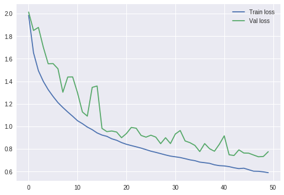


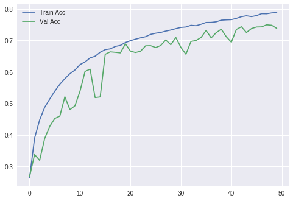  
  
  
  
  
## Model_7 (Introducing kernel regularizer alongside Dropout and kernel_constraint)
  
  
Since our model with higher dropout in the initial layer did not seem to be opmistice, let's try to introduce kernel_regularizer which regulates the weights of the layers by adding the regularizer (L2 is used here) to the loss function. However it is not a good practice to use batchnorm alongside kernel regularizer as these two tend to have a counter intuitive effect on the model. This could be understood from the fact that training/val losses has the same path in the graph. Since we regularized the weights of the model and learning rate (0.001) the model tends to learn slow as we can see that the model has higher loss despite training for 75 epcohs. We can reduce the loss by increasing the epochs but this will not be optimum since the training will take more time. We can try to extract more performance by reducing the **regularizer parameter, removing batchnorm or reducing dropout, etc**  
  
  
###### Hyperparameters
epochs = 75  
lrate = 0.001 
Droupout = 0.3/0.5/0.7  
Batchnorm = Yes  
Kernel Regularizer = Yes  
  
###### Accuracy
Train Accuracy - 77.77  
Val Accuracy   - 73.31  
  
  
```python

# Create the model
model = Sequential()
model.add(Conv2D(32, (3, 3), input_shape=(32, 32,3), padding='same', activation='relu', kernel_regularizer=regularizers.l2(0.01), kernel_constraint=maxnorm(3)))
model.add(Dropout(0.3))
model.add(BatchNormalization())
model.add(Conv2D(32, (3, 3), activation='relu', padding='same', kernel_constraint=maxnorm(3)))
model.add(MaxPool2D(pool_size=(2, 2)))
model.add(Conv2D(64, (3, 3), input_shape=(32, 32,3), padding='same', activation='relu', kernel_regularizer=regularizers.l2(0.01), kernel_constraint=maxnorm(3)))
model.add(Dropout(0.5))
model.add(BatchNormalization())
model.add(Conv2D(64, (3, 3), activation='relu', padding='same', kernel_constraint=maxnorm(3)))
model.add(MaxPool2D(pool_size=(2, 2)))
model.add(Conv2D(128, (3, 3), input_shape=(32, 32,3), padding='valid', activation='relu', kernel_regularizer=regularizers.l2(0.01), kernel_constraint=maxnorm(3)))
model.add(Dropout(0.7))
model.add(BatchNormalization())
model.add(Conv2D(256, (3, 3), activation='relu', padding='valid', kernel_regularizer=regularizers.l2(0.01), kernel_constraint=maxnorm(3)))
model.add(MaxPool2D(pool_size=(2, 2)))
model.add(Conv2D(512, (2, 2), activation='relu', kernel_regularizer=regularizers.l2(0.01)))
model.add(Flatten())
model.add(Dense(num_classes, activation='softmax'))
print(model.summary())

# Compile model
epochs = 75
lrate = 0.001
decay = lrate/epochs
sgd = SGD(lr=lrate, momentum=0.9, decay=decay, nesterov=False)
model.compile(loss='categorical_crossentropy', optimizer=sgd, metrics=['accuracy'])

# Fit the model
seqModel = model.fit(X_train, y_train, validation_data=(X_test, y_test), epochs=epochs, batch_size=256, verbose=2)

```

    _________________________________________________________________
    Layer (type)                 Output Shape              Param #   
    =================================================================
    conv2d_216 (Conv2D)          (None, 32, 32, 32)        896       
    _________________________________________________________________
    dropout_86 (Dropout)         (None, 32, 32, 32)        0         
    _________________________________________________________________
    batch_normalization_82 (Batc (None, 32, 32, 32)        128       
    _________________________________________________________________
    conv2d_217 (Conv2D)          (None, 32, 32, 32)        9248      
    _________________________________________________________________
    max_pooling2d_88 (MaxPooling (None, 16, 16, 32)        0         
    _________________________________________________________________
    conv2d_218 (Conv2D)          (None, 16, 16, 64)        18496     
    _________________________________________________________________
    dropout_87 (Dropout)         (None, 16, 16, 64)        0         
    _________________________________________________________________
    batch_normalization_83 (Batc (None, 16, 16, 64)        256       
    _________________________________________________________________
    conv2d_219 (Conv2D)          (None, 16, 16, 64)        36928     
    _________________________________________________________________
    max_pooling2d_89 (MaxPooling (None, 8, 8, 64)          0         
    _________________________________________________________________
    conv2d_220 (Conv2D)          (None, 6, 6, 128)         73856     
    _________________________________________________________________
    dropout_88 (Dropout)         (None, 6, 6, 128)         0         
    _________________________________________________________________
    batch_normalization_84 (Batc (None, 6, 6, 128)         512       
    _________________________________________________________________
    conv2d_221 (Conv2D)          (None, 4, 4, 256)         295168    
    _________________________________________________________________
    max_pooling2d_90 (MaxPooling (None, 2, 2, 256)         0         
    _________________________________________________________________
    conv2d_222 (Conv2D)          (None, 1, 1, 512)         524800    
    _________________________________________________________________
    flatten_27 (Flatten)         (None, 512)               0         
    _________________________________________________________________
    dense_27 (Dense)             (None, 10)                5130      
    =================================================================
    Total params: 965,418
    Trainable params: 964,970
    Non-trainable params: 448
    _________________________________________________________________
    None
    Train on 50000 samples, validate on 10000 samples
    Epoch 70/75
     - 15s - loss: 0.8388 - acc: 0.7745 - val_loss: 0.9419 - val_acc: 0.7349
    Epoch 71/75
     - 15s - loss: 0.8361 - acc: 0.7752 - val_loss: 0.9007 - val_acc: 0.7538
    Epoch 72/75
     - 15s - loss: 0.8268 - acc: 0.7757 - val_loss: 0.8618 - val_acc: 0.7647
    Epoch 73/75
     - 15s - loss: 0.8226 - acc: 0.7752 - val_loss: 0.8394 - val_acc: 0.7725
    Epoch 74/75
     - 15s - loss: 0.8217 - acc: 0.7789 - val_loss: 0.9562 - val_acc: 0.7302
    Epoch 75/75
     - 15s - loss: 0.8139 - acc: 0.7777 - val_loss: 0.9351 - val_acc: 0.7331
    10000/10000 [==============================] - 2s 218us/step
    Train Accuracy: 73.310000
    Train loss: 93.505305
    
    

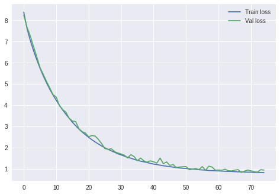


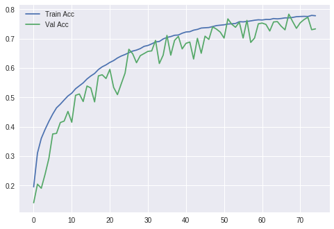  
  
  
  
  
## Take Away

By this playing_with_params we had a great insight of the hyperparameters that governs the performance of any Neural Network model. Indeed this is the artistic manipulation part of the scientific problem solving methods of Machine Learning. This play is more academically called as " Hyperparameter Tuning" in a much more comprehensive way.  
  
**Model_5** seems to be the best of all the models we have tried here. We can keep trying this by tweaking the network in a more robust way to achieve even better performance. That can be don by creating a more complex and problem-specific models and choosing the right hyper_parameters. But to our rescue is the community of researchers who have worked tirelessly and invented many such architectures **( AlexNet, VGG, InceptionNet, Resnet, etc )** that could achive the state ot the art results. These models have proved to perform well on humangous dataset called **IMAGENET** making them more authentic and generalized for any kind of data.
