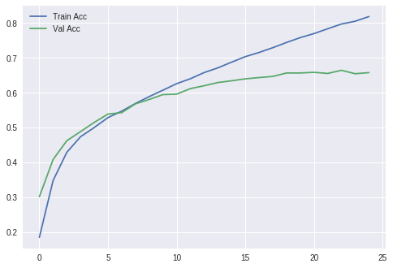
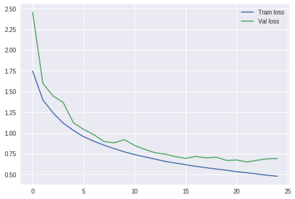
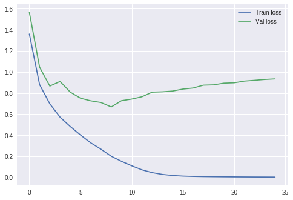
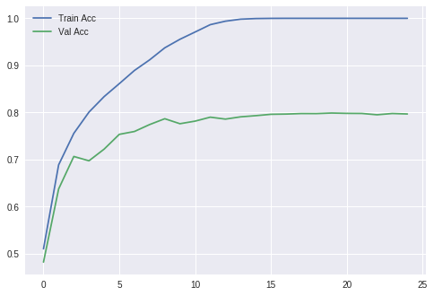
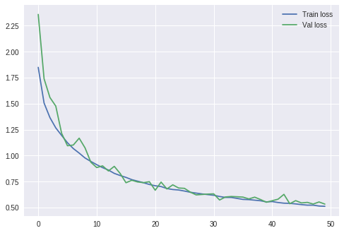
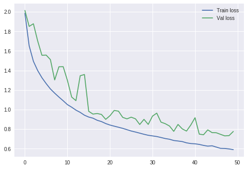
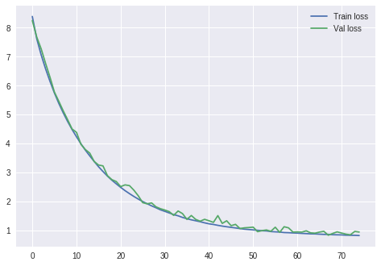

```python
# Simple CNN model for the CIFAR-10 Dataset
import numpy
from keras import callbacks
from keras.datasets import cifar10
from keras.models import Sequential
from keras.layers import Dense
from keras.layers import Dropout
from keras.layers import Flatten
from keras.constraints import maxnorm
from keras.optimizers import SGD
from keras.layers import Conv2D
from keras.layers import MaxPool2D
from keras.utils import np_utils

# fix random seed for reproducibility
seed = 7
numpy.random.seed(seed)

# load data
(X_train, y_train), (X_test, y_test) = cifar10.load_data()

# normalize inputs from 0-255 to 0.0-1.0
X_train = X_train.astype('float32')
X_test = X_test.astype('float32')
X_train = X_train / 255.0
X_test = X_test / 255.0

# one hot encode outputs
y_train = np_utils.to_categorical(y_train)
y_test = np_utils.to_categorical(y_test)
num_classes = y_test.shape[1]

# Create the model
model = Sequential()
model.add(Conv2D(32, (3, 3), input_shape=(32, 32,3), padding='same', activation='relu', kernel_constraint=maxnorm(3)))
model.add(Dropout(0.2))
model.add(Conv2D(32, (3, 3), activation='relu', padding='same', kernel_constraint=maxnorm(3)))
model.add(MaxPool2D(pool_size=(2, 2)))
model.add(Conv2D(64, (3, 3), input_shape=(32, 32,3), padding='same', activation='relu', kernel_constraint=maxnorm(3)))
model.add(Dropout(0.2))
model.add(Conv2D(64, (3, 3), activation='relu', padding='same', kernel_constraint=maxnorm(3)))
model.add(MaxPool2D(pool_size=(2, 2)))
model.add(Conv2D(128, (3, 3), input_shape=(32, 32,3), padding='same', activation='relu', kernel_constraint=maxnorm(3)))
model.add(Dropout(0.2))
model.add(Conv2D(128, (3, 3), activation='relu', padding='same', kernel_constraint=maxnorm(3)))
model.add(MaxPool2D(pool_size=(2, 2)))
model.add(Conv2D(1024, (2, 2), strides=2, activation='relu', padding='valid', kernel_constraint=maxnorm(3)))
model.add(Flatten())
model.add(Dense(num_classes, activation='softmax'))

# Compile model
epochs = 25
lrate = 0.01
decay = lrate/epochs
sgd = SGD(lr=lrate, momentum=0.9, decay=decay, nesterov=False)
model.compile(loss='categorical_crossentropy', optimizer=sgd, metrics=['accuracy'])
print(model.summary())

# Fit the model
seqModel = model.fit(X_train, y_train, validation_data=(X_test, y_test), epochs=epochs, batch_size=256, verbose=2)

# Final evaluation of the model
scores = model.evaluate(X_test, y_test, verbose=1)
print("Train Accuracy: %f" % (scores[1]*100))
print("Train loss: %f" % (scores[0]*100))

# visualizing losses and accuracy
train_loss = seqModel.history['loss']
val_loss = seqModel.history['val_loss']
train_acc = seqModel.history['acc']
val_acc = seqModel.history['val_acc']
xc = range(epochs)

# visualizing losses and accuracy
print(seqModel.history['loss'])
print(seqModel.history['loss'])
print(seqModel.history['loss'])
print(seqModel.history['loss'])

# visualizing losses and accuracy
plt.figure()
plt.plot(xc, train_loss, label='Train loss')
plt.plot(xc, val_loss, label='Val loss')
plt.legend()

# visualizing losses and accuracy
plt.figure()
plt.plot(xc, train_acc, label='Train Acc')
plt.plot(xc, val_acc, label='Val Acc')
plt.legend()
```

    _________________________________________________________________
    Layer (type)                 Output Shape              Param #   
    =================================================================
    conv2d_7 (Conv2D)            (None, 32, 32, 32)        896       
    _________________________________________________________________
    dropout_4 (Dropout)          (None, 32, 32, 32)        0         
    _________________________________________________________________
    conv2d_8 (Conv2D)            (None, 32, 32, 32)        9248      
    _________________________________________________________________
    max_pooling2d_4 (MaxPooling2 (None, 16, 16, 32)        0         
    _________________________________________________________________
    conv2d_9 (Conv2D)            (None, 16, 16, 64)        18496     
    _________________________________________________________________
    dropout_5 (Dropout)          (None, 16, 16, 64)        0         
    _________________________________________________________________
    conv2d_10 (Conv2D)           (None, 16, 16, 64)        36928     
    _________________________________________________________________
    max_pooling2d_5 (MaxPooling2 (None, 8, 8, 64)          0         
    _________________________________________________________________
    conv2d_11 (Conv2D)           (None, 8, 8, 128)         73856     
    _________________________________________________________________
    dropout_6 (Dropout)          (None, 8, 8, 128)         0         
    _________________________________________________________________
    conv2d_12 (Conv2D)           (None, 8, 8, 128)         147584    
    _________________________________________________________________
    max_pooling2d_6 (MaxPooling2 (None, 4, 4, 128)         0         
    _________________________________________________________________
    conv2d_13 (Conv2D)           (None, 2, 2, 1024)        525312    
    _________________________________________________________________
    flatten_1 (Flatten)          (None, 4096)              0         
    _________________________________________________________________
    dense_1 (Dense)              (None, 10)                40970     
    =================================================================
    Total params: 853,290
    Trainable params: 853,290
    Non-trainable params: 0
    _________________________________________________________________
    None
    Train on 50000 samples, validate on 10000 samples
    Epoch 1/25
     - 18s - loss: 2.1801 - acc: 0.1854 - val_loss: 1.9858 - val_acc: 0.3017
    Epoch 2/25
     - 16s - loss: 1.8220 - acc: 0.3482 - val_loss: 1.6961 - val_acc: 0.4086
    Epoch 3/25
     - 16s - loss: 1.5918 - acc: 0.4291 - val_loss: 1.5206 - val_acc: 0.4624
    Epoch 4/25
     - 28s - loss: 1.4719 - acc: 0.4738 - val_loss: 1.4388 - val_acc: 0.4885
    Epoch 5/25
     - 29s - loss: 1.4046 - acc: 0.5003 - val_loss: 1.3563 - val_acc: 0.5149
    Epoch 6/25
     - 30s - loss: 1.3269 - acc: 0.5287 - val_loss: 1.3144 - val_acc: 0.5388
    Epoch 7/25
     - 30s - loss: 1.2718 - acc: 0.5472 - val_loss: 1.2797 - val_acc: 0.5429
    Epoch 8/25
     - 30s - loss: 1.2160 - acc: 0.5691 - val_loss: 1.2185 - val_acc: 0.5681
    Epoch 9/25
     - 30s - loss: 1.1624 - acc: 0.5888 - val_loss: 1.1761 - val_acc: 0.5806
    Epoch 10/25
     - 29s - loss: 1.1112 - acc: 0.6072 - val_loss: 1.1470 - val_acc: 0.5946
    Epoch 11/25
     - 30s - loss: 1.0602 - acc: 0.6259 - val_loss: 1.1263 - val_acc: 0.5959
    Epoch 12/25
     - 29s - loss: 1.0186 - acc: 0.6400 - val_loss: 1.0926 - val_acc: 0.6118
    Epoch 13/25
     - 30s - loss: 0.9761 - acc: 0.6577 - val_loss: 1.0871 - val_acc: 0.6199
    Epoch 14/25
     - 30s - loss: 0.9335 - acc: 0.6712 - val_loss: 1.0437 - val_acc: 0.6291
    Epoch 15/25
     - 30s - loss: 0.8921 - acc: 0.6875 - val_loss: 1.0309 - val_acc: 0.6342
    Epoch 16/25
     - 30s - loss: 0.8456 - acc: 0.7034 - val_loss: 1.0271 - val_acc: 0.6397
    Epoch 17/25
     - 29s - loss: 0.8132 - acc: 0.7153 - val_loss: 1.0107 - val_acc: 0.6434
    Epoch 18/25
     - 30s - loss: 0.7741 - acc: 0.7290 - val_loss: 1.0134 - val_acc: 0.6466
    Epoch 19/25
     - 30s - loss: 0.7313 - acc: 0.7440 - val_loss: 1.0058 - val_acc: 0.6565
    Epoch 20/25
     - 30s - loss: 0.6918 - acc: 0.7579 - val_loss: 1.0063 - val_acc: 0.6565
    Epoch 21/25
     - 29s - loss: 0.6581 - acc: 0.7695 - val_loss: 1.0234 - val_acc: 0.6584
    Epoch 22/25
     - 30s - loss: 0.6187 - acc: 0.7833 - val_loss: 1.0577 - val_acc: 0.6552
    Epoch 23/25
     - 30s - loss: 0.5800 - acc: 0.7969 - val_loss: 1.0224 - val_acc: 0.6642
    Epoch 24/25
     - 30s - loss: 0.5529 - acc: 0.8049 - val_loss: 1.0351 - val_acc: 0.6544
    Epoch 25/25
     - 30s - loss: 0.5143 - acc: 0.8182 - val_loss: 1.0829 - val_acc: 0.6576
    10000/10000 [==============================] - 4s 392us/step
    Train Accuracy: 65.760000
    Train loss: 108.292010
    [2.180137582397461, 1.8219786182403563, 1.591783775100708, 1.4719133519744874, 1.4045587841415406, 1.3269403790283203, 1.2718024642181396, 1.215984945449829, 1.1624219870376586, 1.111247367401123, 1.060171485786438, 1.0186104032707215, 0.976085499382019, 0.9335154978561402, 0.892094608631134, 0.8456368350601197, 0.8131902910995483, 0.7740711432266235, 0.7312777804374695, 0.6917605874252319, 0.6580606756210328, 0.6187281261062622, 0.5800397781562805, 0.5528569592285156, 0.514330131597519]
    [2.180137582397461, 1.8219786182403563, 1.591783775100708, 1.4719133519744874, 1.4045587841415406, 1.3269403790283203, 1.2718024642181396, 1.215984945449829, 1.1624219870376586, 1.111247367401123, 1.060171485786438, 1.0186104032707215, 0.976085499382019, 0.9335154978561402, 0.892094608631134, 0.8456368350601197, 0.8131902910995483, 0.7740711432266235, 0.7312777804374695, 0.6917605874252319, 0.6580606756210328, 0.6187281261062622, 0.5800397781562805, 0.5528569592285156, 0.514330131597519]
    [2.180137582397461, 1.8219786182403563, 1.591783775100708, 1.4719133519744874, 1.4045587841415406, 1.3269403790283203, 1.2718024642181396, 1.215984945449829, 1.1624219870376586, 1.111247367401123, 1.060171485786438, 1.0186104032707215, 0.976085499382019, 0.9335154978561402, 0.892094608631134, 0.8456368350601197, 0.8131902910995483, 0.7740711432266235, 0.7312777804374695, 0.6917605874252319, 0.6580606756210328, 0.6187281261062622, 0.5800397781562805, 0.5528569592285156, 0.514330131597519]
    [2.180137582397461, 1.8219786182403563, 1.591783775100708, 1.4719133519744874, 1.4045587841415406, 1.3269403790283203, 1.2718024642181396, 1.215984945449829, 1.1624219870376586, 1.111247367401123, 1.060171485786438, 1.0186104032707215, 0.976085499382019, 0.9335154978561402, 0.892094608631134, 0.8456368350601197, 0.8131902910995483, 0.7740711432266235, 0.7312777804374695, 0.6917605874252319, 0.6580606756210328, 0.6187281261062622, 0.5800397781562805, 0.5528569592285156, 0.514330131597519]
    


    <matplotlib.legend.Legend at 0x7fc283e04dd8>





**Norm with dopout = 0.4**


```python


# Simple CNN model for the CIFAR-10 Dataset
import numpy
from keras import callbacks
from keras.datasets import cifar10
from keras.models import Sequential
from keras.layers import Dense, BatchNormalization
from keras.layers import Dropout
from keras.layers import Flatten
from keras.constraints import maxnorm
from keras.optimizers import SGD
from keras.layers import Conv2D
from keras.layers import MaxPool2D
from keras.utils import np_utils

# fix random seed for reproducibility
seed = 7
numpy.random.seed(seed)

# load data
(X_train, y_train), (X_test, y_test) = cifar10.load_data()

# normalize inputs from 0-255 to 0.0-1.0
X_train = X_train.astype('float32')
X_test = X_test.astype('float32')
X_train = X_train / 255.0
X_test = X_test / 255.0

# one hot encode outputs
y_train = np_utils.to_categorical(y_train)
y_test = np_utils.to_categorical(y_test)
num_classes = y_test.shape[1]

# Create the model
model = Sequential()
model.add(Conv2D(32, (3, 3), input_shape=(32, 32,3), padding='same', activation='relu', kernel_constraint=maxnorm(3)))
model.add(Dropout(0.4))
model.add(BatchNormalization())
model.add(Conv2D(32, (3, 3), activation='relu', padding='same', kernel_constraint=maxnorm(3)))
model.add(MaxPool2D(pool_size=(2, 2)))
model.add(Conv2D(64, (3, 3), input_shape=(32, 32,3), padding='same', activation='relu', kernel_constraint=maxnorm(3)))
model.add(Dropout(0.4))
model.add(BatchNormalization())
model.add(Conv2D(64, (3, 3), activation='relu', padding='same', kernel_constraint=maxnorm(3)))
model.add(MaxPool2D(pool_size=(2, 2)))
model.add(Conv2D(128, (3, 3), input_shape=(32, 32,3), padding='same', activation='relu', kernel_constraint=maxnorm(3)))
model.add(Dropout(0.4))
model.add(BatchNormalization())
model.add(Conv2D(128, (3, 3), activation='relu', padding='same', kernel_constraint=maxnorm(3)))
model.add(MaxPool2D(pool_size=(2, 2)))


model.add(Conv2D(1024, (2, 2), strides=2, activation='relu', padding='valid', kernel_constraint=maxnorm(3)))
#model.add(Conv2D(10, (2, 2), activation='relu'))
#model.add(Conv2D(10, (1,1), activation='relu'))

model.add(Flatten())
"""model.add(Dropout(0.2))
model.add(Dense(1024, activation='relu', kernel_constraint=maxnorm(3)))
model.add(Dropout(0.2))
model.add(Dense(512, activation='relu', kernel_constraint=maxnorm(3)))
model.add(Dropout(0.2))"""


model.add(Dense(num_classes, activation='softmax'))

# Compile model
epochs = 25
lrate = 0.01
decay = lrate/epochs
sgd = SGD(lr=lrate, momentum=0.9, decay=decay, nesterov=False)
model.compile(loss='categorical_crossentropy', optimizer=sgd, metrics=['accuracy'])
print(model.summary())


# Fit the model
seqModel = model.fit(X_train, y_train, validation_data=(X_test, y_test), epochs=epochs, batch_size=256, verbose=2)

# Final evaluation of the model
scores = model.evaluate(X_test, y_test, verbose=1)
print("Train Accuracy: %f" % (scores[1]*100))
print("Train loss: %f" % (scores[0]*100))

# visualizing losses and accuracy
train_loss = seqModel.history['loss']
val_loss = seqModel.history['val_loss']
train_acc = seqModel.history['acc']
val_acc = seqModel.history['val_acc']
xc = range(epochs)

print(seqModel.history['loss'])

print(seqModel.history['loss'])
print(seqModel.history['loss'])
print(seqModel.history['loss'])

plt.figure()
plt.plot(xc, train_loss, label='Train loss')
plt.plot(xc, val_loss, label='Val loss')
plt.legend()


plt.figure()
plt.plot(xc, train_acc, label='Train Acc')
plt.plot(xc, val_acc, label='Val Acc')
plt.legend()
```

    _________________________________________________________________
    Layer (type)                 Output Shape              Param #   
    =================================================================
    conv2d_15 (Conv2D)           (None, 32, 32, 32)        896       
    _________________________________________________________________
    dropout_8 (Dropout)          (None, 32, 32, 32)        0         
    _________________________________________________________________
    batch_normalization_1 (Batch (None, 32, 32, 32)        128       
    _________________________________________________________________
    conv2d_16 (Conv2D)           (None, 32, 32, 32)        9248      
    _________________________________________________________________
    max_pooling2d_7 (MaxPooling2 (None, 16, 16, 32)        0         
    _________________________________________________________________
    conv2d_17 (Conv2D)           (None, 16, 16, 64)        18496     
    _________________________________________________________________
    dropout_9 (Dropout)          (None, 16, 16, 64)        0         
    _________________________________________________________________
    batch_normalization_2 (Batch (None, 16, 16, 64)        256       
    _________________________________________________________________
    conv2d_18 (Conv2D)           (None, 16, 16, 64)        36928     
    _________________________________________________________________
    max_pooling2d_8 (MaxPooling2 (None, 8, 8, 64)          0         
    _________________________________________________________________
    conv2d_19 (Conv2D)           (None, 8, 8, 128)         73856     
    _________________________________________________________________
    dropout_10 (Dropout)         (None, 8, 8, 128)         0         
    _________________________________________________________________
    batch_normalization_3 (Batch (None, 8, 8, 128)         512       
    _________________________________________________________________
    conv2d_20 (Conv2D)           (None, 8, 8, 128)         147584    
    _________________________________________________________________
    max_pooling2d_9 (MaxPooling2 (None, 4, 4, 128)         0         
    _________________________________________________________________
    conv2d_21 (Conv2D)           (None, 2, 2, 1024)        525312    
    _________________________________________________________________
    flatten_2 (Flatten)          (None, 4096)              0         
    _________________________________________________________________
    dense_2 (Dense)              (None, 10)                40970     
    =================================================================
    Total params: 854,186
    Trainable params: 853,738
    Non-trainable params: 448
    _________________________________________________________________
    None
    Train on 50000 samples, validate on 10000 samples
    Epoch 1/25
     - 18s - loss: 1.7473 - acc: 0.3601 - val_loss: 2.4552 - val_acc: 0.2157
    Epoch 2/25
     - 17s - loss: 1.3999 - acc: 0.4913 - val_loss: 1.5993 - val_acc: 0.4437
    Epoch 3/25
     - 17s - loss: 1.2433 - acc: 0.5520 - val_loss: 1.4470 - val_acc: 0.4825
    Epoch 4/25
     - 17s - loss: 1.1191 - acc: 0.5987 - val_loss: 1.3671 - val_acc: 0.5240
    Epoch 5/25
     - 17s - loss: 1.0303 - acc: 0.6351 - val_loss: 1.1225 - val_acc: 0.5995
    Epoch 6/25
     - 17s - loss: 0.9553 - acc: 0.6608 - val_loss: 1.0443 - val_acc: 0.6317
    Epoch 7/25
     - 17s - loss: 0.9008 - acc: 0.6816 - val_loss: 0.9798 - val_acc: 0.6522
    Epoch 8/25
     - 17s - loss: 0.8527 - acc: 0.6998 - val_loss: 0.8971 - val_acc: 0.6833
    Epoch 9/25
     - 17s - loss: 0.8120 - acc: 0.7135 - val_loss: 0.8817 - val_acc: 0.6885
    Epoch 10/25
     - 17s - loss: 0.7719 - acc: 0.7261 - val_loss: 0.9201 - val_acc: 0.6817
    Epoch 11/25
     - 17s - loss: 0.7401 - acc: 0.7384 - val_loss: 0.8490 - val_acc: 0.7029
    Epoch 12/25
     - 17s - loss: 0.7122 - acc: 0.7475 - val_loss: 0.8027 - val_acc: 0.7154
    Epoch 13/25
     - 17s - loss: 0.6852 - acc: 0.7587 - val_loss: 0.7620 - val_acc: 0.7346
    Epoch 14/25
     - 17s - loss: 0.6576 - acc: 0.7690 - val_loss: 0.7456 - val_acc: 0.7392
    Epoch 15/25
     - 17s - loss: 0.6380 - acc: 0.7749 - val_loss: 0.7152 - val_acc: 0.7552
    Epoch 16/25
     - 17s - loss: 0.6177 - acc: 0.7807 - val_loss: 0.6941 - val_acc: 0.7613
    Epoch 17/25
     - 17s - loss: 0.5981 - acc: 0.7897 - val_loss: 0.7178 - val_acc: 0.7519
    Epoch 18/25
     - 17s - loss: 0.5817 - acc: 0.7960 - val_loss: 0.7002 - val_acc: 0.7575
    Epoch 19/25
     - 17s - loss: 0.5655 - acc: 0.8018 - val_loss: 0.7079 - val_acc: 0.7533
    Epoch 20/25
     - 17s - loss: 0.5516 - acc: 0.8072 - val_loss: 0.6694 - val_acc: 0.7693
    Epoch 21/25
     - 17s - loss: 0.5335 - acc: 0.8122 - val_loss: 0.6749 - val_acc: 0.7642
    Epoch 22/25
     - 17s - loss: 0.5210 - acc: 0.8175 - val_loss: 0.6506 - val_acc: 0.7769
    Epoch 23/25
     - 17s - loss: 0.5056 - acc: 0.8214 - val_loss: 0.6712 - val_acc: 0.7730
    Epoch 24/25
     - 17s - loss: 0.4908 - acc: 0.8268 - val_loss: 0.6888 - val_acc: 0.7654
    Epoch 25/25
     - 17s - loss: 0.4790 - acc: 0.8312 - val_loss: 0.6920 - val_acc: 0.7645
    10000/10000 [==============================] - 2s 182us/step
    Train Accuracy: 76.450000
    Train loss: 69.204978
    [1.7472805899047852, 1.3998592733764648, 1.243306848487854, 1.1191049350738524, 1.0302609516906738, 0.9553095379257203, 0.9007634576225281, 0.8527492238235473, 0.8120429638290405, 0.7719226119041442, 0.7401483281326294, 0.7122437092781067, 0.6852455173110962, 0.657605472240448, 0.6379761841011047, 0.6177403483963013, 0.5980632929801941, 0.5816877400970459, 0.5655117426490783, 0.551578545703888, 0.53345332736969, 0.5209756022453308, 0.5056452375602722, 0.4907785739135742, 0.4790259319114685]
    [1.7472805899047852, 1.3998592733764648, 1.243306848487854, 1.1191049350738524, 1.0302609516906738, 0.9553095379257203, 0.9007634576225281, 0.8527492238235473, 0.8120429638290405, 0.7719226119041442, 0.7401483281326294, 0.7122437092781067, 0.6852455173110962, 0.657605472240448, 0.6379761841011047, 0.6177403483963013, 0.5980632929801941, 0.5816877400970459, 0.5655117426490783, 0.551578545703888, 0.53345332736969, 0.5209756022453308, 0.5056452375602722, 0.4907785739135742, 0.4790259319114685]
    [1.7472805899047852, 1.3998592733764648, 1.243306848487854, 1.1191049350738524, 1.0302609516906738, 0.9553095379257203, 0.9007634576225281, 0.8527492238235473, 0.8120429638290405, 0.7719226119041442, 0.7401483281326294, 0.7122437092781067, 0.6852455173110962, 0.657605472240448, 0.6379761841011047, 0.6177403483963013, 0.5980632929801941, 0.5816877400970459, 0.5655117426490783, 0.551578545703888, 0.53345332736969, 0.5209756022453308, 0.5056452375602722, 0.4907785739135742, 0.4790259319114685]
    [1.7472805899047852, 1.3998592733764648, 1.243306848487854, 1.1191049350738524, 1.0302609516906738, 0.9553095379257203, 0.9007634576225281, 0.8527492238235473, 0.8120429638290405, 0.7719226119041442, 0.7401483281326294, 0.7122437092781067, 0.6852455173110962, 0.657605472240448, 0.6379761841011047, 0.6177403483963013, 0.5980632929801941, 0.5816877400970459, 0.5655117426490783, 0.551578545703888, 0.53345332736969, 0.5209756022453308, 0.5056452375602722, 0.4907785739135742, 0.4790259319114685]
    


    <matplotlib.legend.Legend at 0x7fc280aa6ef0>





**Norm with dropout = 0.2**


```python


# Simple CNN model for the CIFAR-10 Dataset
import numpy
from keras import callbacks
from keras.datasets import cifar10
from keras.models import Sequential
from keras.layers import Dense, BatchNormalization
from keras.layers import Dropout
from keras.layers import Flatten
from keras.constraints import maxnorm
from keras.optimizers import SGD
from keras.layers import Conv2D
from keras.layers import MaxPool2D
from keras.utils import np_utils

# fix random seed for reproducibility
seed = 7
numpy.random.seed(seed)

# load data
(X_train, y_train), (X_test, y_test) = cifar10.load_data()

# normalize inputs from 0-255 to 0.0-1.0
X_train = X_train.astype('float32')
X_test = X_test.astype('float32')
X_train = X_train / 255.0
X_test = X_test / 255.0

# one hot encode outputs
y_train = np_utils.to_categorical(y_train)
y_test = np_utils.to_categorical(y_test)
num_classes = y_test.shape[1]

# Create the model
model = Sequential()
model.add(Conv2D(32, (3, 3), input_shape=(32, 32,3), padding='same', activation='relu', kernel_constraint=maxnorm(3)))
model.add(Dropout(0.2))
model.add(BatchNormalization())
model.add(Conv2D(32, (3, 3), activation='relu', padding='same', kernel_constraint=maxnorm(3)))
model.add(MaxPool2D(pool_size=(2, 2)))
model.add(Conv2D(64, (3, 3), input_shape=(32, 32,3), padding='same', activation='relu', kernel_constraint=maxnorm(3)))
model.add(Dropout(0.2))
model.add(BatchNormalization())
model.add(Conv2D(64, (3, 3), activation='relu', padding='same', kernel_constraint=maxnorm(3)))
model.add(MaxPool2D(pool_size=(2, 2)))
model.add(Conv2D(128, (3, 3), input_shape=(32, 32,3), padding='same', activation='relu', kernel_constraint=maxnorm(3)))
model.add(Dropout(0.2))
model.add(BatchNormalization())
model.add(Conv2D(128, (3, 3), activation='relu', padding='same', kernel_constraint=maxnorm(3)))
model.add(MaxPool2D(pool_size=(2, 2)))


model.add(Conv2D(1024, (2, 2), strides=2, activation='relu', padding='valid', kernel_constraint=maxnorm(3)))
#model.add(Conv2D(10, (2, 2), activation='relu'))
#model.add(Conv2D(10, (1,1), activation='relu'))

model.add(Flatten())
"""model.add(Dropout(0.2))
model.add(Dense(1024, activation='relu', kernel_constraint=maxnorm(3)))
model.add(Dropout(0.2))
model.add(Dense(512, activation='relu', kernel_constraint=maxnorm(3)))
model.add(Dropout(0.2))"""


model.add(Dense(num_classes, activation='softmax'))

# Compile model
epochs = 25
lrate = 0.01
decay = lrate/epochs
sgd = SGD(lr=lrate, momentum=0.9, decay=decay, nesterov=False)
model.compile(loss='categorical_crossentropy', optimizer=sgd, metrics=['accuracy'])
print(model.summary())


# Fit the model
seqModel = model.fit(X_train, y_train, validation_data=(X_test, y_test), epochs=epochs, batch_size=256, verbose=2)

# Final evaluation of the model
scores = model.evaluate(X_test, y_test, verbose=1)
print("Train Accuracy: %f" % (scores[1]*100))
print("Train loss: %f" % (scores[0]*100))

# visualizing losses and accuracy
train_loss = seqModel.history['loss']
val_loss = seqModel.history['val_loss']
train_acc = seqModel.history['acc']
val_acc = seqModel.history['val_acc']
xc = range(epochs)

print(seqModel.history['loss'])

print(seqModel.history['loss'])
print(seqModel.history['loss'])
print(seqModel.history['loss'])

plt.figure()
plt.plot(xc, train_loss, label='Train loss')
plt.plot(xc, val_loss, label='Val loss')
plt.legend()


plt.figure()
plt.plot(xc, train_acc, label='Train Acc')
plt.plot(xc, val_acc, label='Val Acc')
plt.legend()
```

    _________________________________________________________________
    Layer (type)                 Output Shape              Param #   
    =================================================================
    conv2d_22 (Conv2D)           (None, 32, 32, 32)        896       
    _________________________________________________________________
    dropout_11 (Dropout)         (None, 32, 32, 32)        0         
    _________________________________________________________________
    batch_normalization_4 (Batch (None, 32, 32, 32)        128       
    _________________________________________________________________
    conv2d_23 (Conv2D)           (None, 32, 32, 32)        9248      
    _________________________________________________________________
    max_pooling2d_10 (MaxPooling (None, 16, 16, 32)        0         
    _________________________________________________________________
    conv2d_24 (Conv2D)           (None, 16, 16, 64)        18496     
    _________________________________________________________________
    dropout_12 (Dropout)         (None, 16, 16, 64)        0         
    _________________________________________________________________
    batch_normalization_5 (Batch (None, 16, 16, 64)        256       
    _________________________________________________________________
    conv2d_25 (Conv2D)           (None, 16, 16, 64)        36928     
    _________________________________________________________________
    max_pooling2d_11 (MaxPooling (None, 8, 8, 64)          0         
    _________________________________________________________________
    conv2d_26 (Conv2D)           (None, 8, 8, 128)         73856     
    _________________________________________________________________
    dropout_13 (Dropout)         (None, 8, 8, 128)         0         
    _________________________________________________________________
    batch_normalization_6 (Batch (None, 8, 8, 128)         512       
    _________________________________________________________________
    conv2d_27 (Conv2D)           (None, 8, 8, 128)         147584    
    _________________________________________________________________
    max_pooling2d_12 (MaxPooling (None, 4, 4, 128)         0         
    _________________________________________________________________
    conv2d_28 (Conv2D)           (None, 2, 2, 1024)        525312    
    _________________________________________________________________
    flatten_3 (Flatten)          (None, 4096)              0         
    _________________________________________________________________
    dense_3 (Dense)              (None, 10)                40970     
    =================================================================
    Total params: 854,186
    Trainable params: 853,738
    Non-trainable params: 448
    _________________________________________________________________
    None
    Train on 50000 samples, validate on 10000 samples
    Epoch 1/25
     - 18s - loss: 1.5934 - acc: 0.4190 - val_loss: 1.5782 - val_acc: 0.4270
    Epoch 2/25
     - 17s - loss: 1.2050 - acc: 0.5666 - val_loss: 1.2124 - val_acc: 0.5573
    Epoch 3/25
     - 17s - loss: 1.0017 - acc: 0.6422 - val_loss: 1.0447 - val_acc: 0.6319
    Epoch 4/25
     - 17s - loss: 0.8627 - acc: 0.6946 - val_loss: 0.9141 - val_acc: 0.6807
    Epoch 5/25
     - 17s - loss: 0.7737 - acc: 0.7287 - val_loss: 0.9521 - val_acc: 0.6766
    Epoch 6/25
     - 17s - loss: 0.6948 - acc: 0.7548 - val_loss: 0.7887 - val_acc: 0.7280
    Epoch 7/25
     - 17s - loss: 0.6427 - acc: 0.7753 - val_loss: 0.7100 - val_acc: 0.7569
    Epoch 8/25
     - 17s - loss: 0.5913 - acc: 0.7942 - val_loss: 0.7204 - val_acc: 0.7558
    Epoch 9/25
     - 17s - loss: 0.5480 - acc: 0.8089 - val_loss: 0.6995 - val_acc: 0.7550
    Epoch 10/25
     - 17s - loss: 0.5204 - acc: 0.8169 - val_loss: 0.6764 - val_acc: 0.7690
    Epoch 11/25
     - 17s - loss: 0.4849 - acc: 0.8319 - val_loss: 0.6357 - val_acc: 0.7865
    Epoch 12/25
     - 17s - loss: 0.4559 - acc: 0.8394 - val_loss: 0.6558 - val_acc: 0.7814
    Epoch 13/25
     - 17s - loss: 0.4310 - acc: 0.8506 - val_loss: 0.5974 - val_acc: 0.7998
    Epoch 14/25
     - 17s - loss: 0.4047 - acc: 0.8590 - val_loss: 0.6013 - val_acc: 0.7935
    Epoch 15/25
     - 17s - loss: 0.3786 - acc: 0.8683 - val_loss: 0.6090 - val_acc: 0.7929
    Epoch 16/25
     - 17s - loss: 0.3612 - acc: 0.8740 - val_loss: 0.6028 - val_acc: 0.7981
    Epoch 17/25
     - 17s - loss: 0.3438 - acc: 0.8797 - val_loss: 0.6430 - val_acc: 0.7882
    Epoch 18/25
     - 17s - loss: 0.3269 - acc: 0.8873 - val_loss: 0.5950 - val_acc: 0.8058
    Epoch 19/25
     - 17s - loss: 0.3110 - acc: 0.8912 - val_loss: 0.5912 - val_acc: 0.8058
    Epoch 20/25
     - 17s - loss: 0.2930 - acc: 0.8991 - val_loss: 0.5903 - val_acc: 0.8127
    Epoch 21/25
     - 17s - loss: 0.2743 - acc: 0.9055 - val_loss: 0.5931 - val_acc: 0.8076
    Epoch 22/25
     - 17s - loss: 0.2661 - acc: 0.9070 - val_loss: 0.6059 - val_acc: 0.8067
    Epoch 23/25
     - 17s - loss: 0.2487 - acc: 0.9144 - val_loss: 0.5761 - val_acc: 0.8164
    Epoch 24/25
     - 17s - loss: 0.2369 - acc: 0.9191 - val_loss: 0.5900 - val_acc: 0.8141
    Epoch 25/25
     - 17s - loss: 0.2232 - acc: 0.9231 - val_loss: 0.6041 - val_acc: 0.8101
    10000/10000 [==============================] - 2s 182us/step
    Train Accuracy: 81.010000
    Train loss: 60.405836
    [1.5933811981582642, 1.2049533403205872, 1.0016970528411866, 0.8626999221611023, 0.7736703709220886, 0.6947603482437134, 0.6426708371353149, 0.5913173643875123, 0.5479696728897094, 0.5203531579494476, 0.48487038898468016, 0.45586941336631776, 0.43096364419937133, 0.40472514479637145, 0.3786483988523483, 0.36116938261032105, 0.343811129322052, 0.32688124574661254, 0.31104386437416076, 0.29298758659362795, 0.2742523669910431, 0.26606841477394105, 0.24866447060585023, 0.23692532804489136, 0.22319211279392243]
    [1.5933811981582642, 1.2049533403205872, 1.0016970528411866, 0.8626999221611023, 0.7736703709220886, 0.6947603482437134, 0.6426708371353149, 0.5913173643875123, 0.5479696728897094, 0.5203531579494476, 0.48487038898468016, 0.45586941336631776, 0.43096364419937133, 0.40472514479637145, 0.3786483988523483, 0.36116938261032105, 0.343811129322052, 0.32688124574661254, 0.31104386437416076, 0.29298758659362795, 0.2742523669910431, 0.26606841477394105, 0.24866447060585023, 0.23692532804489136, 0.22319211279392243]
    [1.5933811981582642, 1.2049533403205872, 1.0016970528411866, 0.8626999221611023, 0.7736703709220886, 0.6947603482437134, 0.6426708371353149, 0.5913173643875123, 0.5479696728897094, 0.5203531579494476, 0.48487038898468016, 0.45586941336631776, 0.43096364419937133, 0.40472514479637145, 0.3786483988523483, 0.36116938261032105, 0.343811129322052, 0.32688124574661254, 0.31104386437416076, 0.29298758659362795, 0.2742523669910431, 0.26606841477394105, 0.24866447060585023, 0.23692532804489136, 0.22319211279392243]
    [1.5933811981582642, 1.2049533403205872, 1.0016970528411866, 0.8626999221611023, 0.7736703709220886, 0.6947603482437134, 0.6426708371353149, 0.5913173643875123, 0.5479696728897094, 0.5203531579494476, 0.48487038898468016, 0.45586941336631776, 0.43096364419937133, 0.40472514479637145, 0.3786483988523483, 0.36116938261032105, 0.343811129322052, 0.32688124574661254, 0.31104386437416076, 0.29298758659362795, 0.2742523669910431, 0.26606841477394105, 0.24866447060585023, 0.23692532804489136, 0.22319211279392243]
    


    <matplotlib.legend.Legend at 0x7fc26ff7f470>


**Norm without dropout**


```python


# Simple CNN model for the CIFAR-10 Dataset
import numpy
from keras import callbacks
from keras.datasets import cifar10
from keras.models import Sequential
from keras.layers import Dense, BatchNormalization
from keras.layers import Dropout
from keras.layers import Flatten
from keras.constraints import maxnorm
from keras.optimizers import SGD
from keras.layers import Conv2D
from keras.layers import MaxPool2D
from keras.utils import np_utils

# fix random seed for reproducibility
seed = 7
numpy.random.seed(seed)

# load data
(X_train, y_train), (X_test, y_test) = cifar10.load_data()

# normalize inputs from 0-255 to 0.0-1.0
X_train = X_train.astype('float32')
X_test = X_test.astype('float32')
X_train = X_train / 255.0
X_test = X_test / 255.0

# one hot encode outputs
y_train = np_utils.to_categorical(y_train)
y_test = np_utils.to_categorical(y_test)
num_classes = y_test.shape[1]

# Create the model
model = Sequential()
model.add(Conv2D(32, (3, 3), input_shape=(32, 32,3), padding='same', activation='relu', kernel_constraint=maxnorm(3)))
#model.add(Dropout(0.4))
model.add(BatchNormalization())
model.add(Conv2D(32, (3, 3), activation='relu', padding='same', kernel_constraint=maxnorm(3)))
model.add(MaxPool2D(pool_size=(2, 2)))
model.add(Conv2D(64, (3, 3), input_shape=(32, 32,3), padding='same', activation='relu', kernel_constraint=maxnorm(3)))
#model.add(Dropout(0.4))
model.add(BatchNormalization())
model.add(Conv2D(64, (3, 3), activation='relu', padding='same', kernel_constraint=maxnorm(3)))
model.add(MaxPool2D(pool_size=(2, 2)))
model.add(Conv2D(128, (3, 3), input_shape=(32, 32,3), padding='same', activation='relu', kernel_constraint=maxnorm(3)))
#model.add(Dropout(0.4))
model.add(BatchNormalization())
model.add(Conv2D(128, (3, 3), activation='relu', padding='same', kernel_constraint=maxnorm(3)))
model.add(MaxPool2D(pool_size=(2, 2)))


model.add(Conv2D(1024, (2, 2), strides=2, activation='relu', padding='valid', kernel_constraint=maxnorm(3)))
#model.add(Conv2D(10, (2, 2), activation='relu'))
#model.add(Conv2D(10, (1,1), activation='relu'))

model.add(Flatten())
"""model.add(Dropout(0.2))
model.add(Dense(1024, activation='relu', kernel_constraint=maxnorm(3)))
model.add(Dropout(0.2))
model.add(Dense(512, activation='relu', kernel_constraint=maxnorm(3)))
model.add(Dropout(0.2))"""


model.add(Dense(num_classes, activation='softmax'))

# Compile model
epochs = 25
lrate = 0.01
decay = lrate/epochs
sgd = SGD(lr=lrate, momentum=0.9, decay=decay, nesterov=False)
model.compile(loss='categorical_crossentropy', optimizer=sgd, metrics=['accuracy'])
print(model.summary())


# Fit the model
seqModel = model.fit(X_train, y_train, validation_data=(X_test, y_test), epochs=epochs, batch_size=256, verbose=2)

# Final evaluation of the model
scores = model.evaluate(X_test, y_test, verbose=1)
print("Train Accuracy: %f" % (scores[1]*100))
print("Train loss: %f" % (scores[0]*100))

# visualizing losses and accuracy
train_loss = seqModel.history['loss']
val_loss = seqModel.history['val_loss']
train_acc = seqModel.history['acc']
val_acc = seqModel.history['val_acc']
xc = range(epochs)

print(seqModel.history['loss'])

print(seqModel.history['loss'])
print(seqModel.history['loss'])
print(seqModel.history['loss'])

plt.figure()
plt.plot(xc, train_loss, label='Train loss')
plt.plot(xc, val_loss, label='Val loss')
plt.legend()


plt.figure()
plt.plot(xc, train_acc, label='Train Acc')
plt.plot(xc, val_acc, label='Val Acc')
plt.legend()
```

    _________________________________________________________________
    Layer (type)                 Output Shape              Param #   
    =================================================================
    conv2d_29 (Conv2D)           (None, 32, 32, 32)        896       
    _________________________________________________________________
    batch_normalization_7 (Batch (None, 32, 32, 32)        128       
    _________________________________________________________________
    conv2d_30 (Conv2D)           (None, 32, 32, 32)        9248      
    _________________________________________________________________
    max_pooling2d_13 (MaxPooling (None, 16, 16, 32)        0         
    _________________________________________________________________
    conv2d_31 (Conv2D)           (None, 16, 16, 64)        18496     
    _________________________________________________________________
    batch_normalization_8 (Batch (None, 16, 16, 64)        256       
    _________________________________________________________________
    conv2d_32 (Conv2D)           (None, 16, 16, 64)        36928     
    _________________________________________________________________
    max_pooling2d_14 (MaxPooling (None, 8, 8, 64)          0         
    _________________________________________________________________
    conv2d_33 (Conv2D)           (None, 8, 8, 128)         73856     
    _________________________________________________________________
    batch_normalization_9 (Batch (None, 8, 8, 128)         512       
    _________________________________________________________________
    conv2d_34 (Conv2D)           (None, 8, 8, 128)         147584    
    _________________________________________________________________
    max_pooling2d_15 (MaxPooling (None, 4, 4, 128)         0         
    _________________________________________________________________
    conv2d_35 (Conv2D)           (None, 2, 2, 1024)        525312    
    _________________________________________________________________
    flatten_4 (Flatten)          (None, 4096)              0         
    _________________________________________________________________
    dense_4 (Dense)              (None, 10)                40970     
    =================================================================
    Total params: 854,186
    Trainable params: 853,738
    Non-trainable params: 448
    _________________________________________________________________
    None
    Train on 50000 samples, validate on 10000 samples
    Epoch 1/25
     - 16s - loss: 1.3602 - acc: 0.5101 - val_loss: 1.5656 - val_acc: 0.4819
    Epoch 2/25
     - 15s - loss: 0.8810 - acc: 0.6886 - val_loss: 1.0464 - val_acc: 0.6374
    Epoch 3/25
     - 15s - loss: 0.6984 - acc: 0.7555 - val_loss: 0.8668 - val_acc: 0.7064
    Epoch 4/25
     - 15s - loss: 0.5724 - acc: 0.8007 - val_loss: 0.9110 - val_acc: 0.6972
    Epoch 5/25
     - 15s - loss: 0.4831 - acc: 0.8336 - val_loss: 0.8093 - val_acc: 0.7220
    Epoch 6/25
     - 15s - loss: 0.4030 - acc: 0.8611 - val_loss: 0.7519 - val_acc: 0.7534
    Epoch 7/25
     - 15s - loss: 0.3285 - acc: 0.8892 - val_loss: 0.7270 - val_acc: 0.7595
    Epoch 8/25
     - 15s - loss: 0.2683 - acc: 0.9117 - val_loss: 0.7111 - val_acc: 0.7742
    Epoch 9/25
     - 15s - loss: 0.2018 - acc: 0.9373 - val_loss: 0.6691 - val_acc: 0.7866
    Epoch 10/25
     - 15s - loss: 0.1536 - acc: 0.9554 - val_loss: 0.7282 - val_acc: 0.7760
    Epoch 11/25
     - 15s - loss: 0.1111 - acc: 0.9709 - val_loss: 0.7437 - val_acc: 0.7815
    Epoch 12/25
     - 15s - loss: 0.0730 - acc: 0.9865 - val_loss: 0.7656 - val_acc: 0.7899
    Epoch 13/25
     - 15s - loss: 0.0468 - acc: 0.9939 - val_loss: 0.8095 - val_acc: 0.7858
    Epoch 14/25
     - 25s - loss: 0.0294 - acc: 0.9982 - val_loss: 0.8127 - val_acc: 0.7906
    Epoch 15/25
     - 22s - loss: 0.0192 - acc: 0.9995 - val_loss: 0.8198 - val_acc: 0.7931
    Epoch 16/25
     - 28s - loss: 0.0136 - acc: 0.9999 - val_loss: 0.8385 - val_acc: 0.7960
    Epoch 17/25
     - 28s - loss: 0.0106 - acc: 1.0000 - val_loss: 0.8484 - val_acc: 0.7965
    Epoch 18/25
     - 28s - loss: 0.0087 - acc: 1.0000 - val_loss: 0.8755 - val_acc: 0.7976
    Epoch 19/25
     - 28s - loss: 0.0075 - acc: 1.0000 - val_loss: 0.8784 - val_acc: 0.7975
    Epoch 20/25
     - 28s - loss: 0.0066 - acc: 1.0000 - val_loss: 0.8943 - val_acc: 0.7987
    Epoch 21/25
     - 28s - loss: 0.0058 - acc: 1.0000 - val_loss: 0.8979 - val_acc: 0.7980
    Epoch 22/25
     - 28s - loss: 0.0053 - acc: 1.0000 - val_loss: 0.9140 - val_acc: 0.7978
    Epoch 23/25
     - 28s - loss: 0.0048 - acc: 1.0000 - val_loss: 0.9215 - val_acc: 0.7950
    Epoch 24/25
     - 28s - loss: 0.0045 - acc: 1.0000 - val_loss: 0.9297 - val_acc: 0.7977
    Epoch 25/25
     - 28s - loss: 0.0041 - acc: 1.0000 - val_loss: 0.9352 - val_acc: 0.7967
    10000/10000 [==============================] - 4s 429us/step
    Train Accuracy: 79.670000
    Train loss: 93.515955
    [1.3602358627319335, 0.881031652393341, 0.6984077749633789, 0.5723643504905701, 0.48311270483016966, 0.40302970908164976, 0.32845208298683165, 0.26828345249652863, 0.2018051422739029, 0.1536110021185875, 0.11109090151309967, 0.07298775304317474, 0.04675825172483921, 0.029361418633461, 0.019249000594317913, 0.013607363638877868, 0.010563672797083855, 0.008691020043492316, 0.007531412487626076, 0.006590432230532169, 0.005817452454864979, 0.005278017767667771, 0.00480858837634325, 0.00451230366691947, 0.004123692067265511]
    [1.3602358627319335, 0.881031652393341, 0.6984077749633789, 0.5723643504905701, 0.48311270483016966, 0.40302970908164976, 0.32845208298683165, 0.26828345249652863, 0.2018051422739029, 0.1536110021185875, 0.11109090151309967, 0.07298775304317474, 0.04675825172483921, 0.029361418633461, 0.019249000594317913, 0.013607363638877868, 0.010563672797083855, 0.008691020043492316, 0.007531412487626076, 0.006590432230532169, 0.005817452454864979, 0.005278017767667771, 0.00480858837634325, 0.00451230366691947, 0.004123692067265511]
    [1.3602358627319335, 0.881031652393341, 0.6984077749633789, 0.5723643504905701, 0.48311270483016966, 0.40302970908164976, 0.32845208298683165, 0.26828345249652863, 0.2018051422739029, 0.1536110021185875, 0.11109090151309967, 0.07298775304317474, 0.04675825172483921, 0.029361418633461, 0.019249000594317913, 0.013607363638877868, 0.010563672797083855, 0.008691020043492316, 0.007531412487626076, 0.006590432230532169, 0.005817452454864979, 0.005278017767667771, 0.00480858837634325, 0.00451230366691947, 0.004123692067265511]
    [1.3602358627319335, 0.881031652393341, 0.6984077749633789, 0.5723643504905701, 0.48311270483016966, 0.40302970908164976, 0.32845208298683165, 0.26828345249652863, 0.2018051422739029, 0.1536110021185875, 0.11109090151309967, 0.07298775304317474, 0.04675825172483921, 0.029361418633461, 0.019249000594317913, 0.013607363638877868, 0.010563672797083855, 0.008691020043492316, 0.007531412487626076, 0.006590432230532169, 0.005817452454864979, 0.005278017767667771, 0.00480858837634325, 0.00451230366691947, 0.004123692067265511]
    


    <matplotlib.legend.Legend at 0x7fc26f55df28>








**Norm with more dropout**


```python


# Simple CNN model for the CIFAR-10 Dataset
import numpy
from keras import callbacks
from keras.datasets import cifar10
from keras.models import Sequential
from keras.layers import Dense, BatchNormalization
from keras.layers import Dropout
from keras.layers import Flatten
from keras.constraints import maxnorm
from keras.optimizers import SGD
from keras.layers import Conv2D
from keras.layers import MaxPool2D
from keras.utils import np_utils

# fix random seed for reproducibility
seed = 7
numpy.random.seed(seed)

# load data
(X_train, y_train), (X_test, y_test) = cifar10.load_data()

# normalize inputs from 0-255 to 0.0-1.0
X_train = X_train.astype('float32')
X_test = X_test.astype('float32')
X_train = X_train / 255.0
X_test = X_test / 255.0

# one hot encode outputs
y_train = np_utils.to_categorical(y_train)
y_test = np_utils.to_categorical(y_test)
num_classes = y_test.shape[1]

# Create the model
model = Sequential()
model.add(Conv2D(32, (3, 3), input_shape=(32, 32,3), padding='same', activation='relu', kernel_constraint=maxnorm(3)))
model.add(Dropout(0.3))
model.add(BatchNormalization())
model.add(Conv2D(32, (3, 3), activation='relu', padding='same', kernel_constraint=maxnorm(3)))
model.add(MaxPool2D(pool_size=(2, 2)))
model.add(Conv2D(64, (3, 3), input_shape=(32, 32,3), padding='same', activation='relu', kernel_constraint=maxnorm(3)))
model.add(Dropout(0.5))
model.add(BatchNormalization())
model.add(Conv2D(64, (3, 3), activation='relu', padding='same', kernel_constraint=maxnorm(3)))
model.add(MaxPool2D(pool_size=(2, 2)))
model.add(Conv2D(128, (3, 3), input_shape=(32, 32,3), padding='valid', activation='relu', kernel_constraint=maxnorm(3)))
model.add(Dropout(0.7))
model.add(BatchNormalization())
model.add(Conv2D(256, (3, 3), activation='relu', padding='valid', kernel_constraint=maxnorm(3)))
model.add(MaxPool2D(pool_size=(2, 2)))


#model.add(Conv2D(256, (3, 3), strides=1, activation='relu', padding='same', kernel_constraint=maxnorm(3)))
model.add(Conv2D(512, (2, 2), activation='relu'))
#model.add(Conv2D(10, (1,1), activation='relu'))

model.add(Flatten())
"""model.add(Dropout(0.2))
model.add(Dense(1024, activation='relu', kernel_constraint=maxnorm(3)))
model.add(Dropout(0.2))
model.add(Dense(512, activation='relu', kernel_constraint=maxnorm(3)))
model.add(Dropout(0.2))"""


model.add(Dense(num_classes, activation='softmax'))

# Compile model
epochs = 50
lrate = 0.01
decay = lrate/epochs
sgd = SGD(lr=lrate, momentum=0.9, decay=decay, nesterov=False)
model.compile(loss='categorical_crossentropy', optimizer=sgd, metrics=['accuracy'])
print(model.summary())


# Fit the model
seqModel = model.fit(X_train, y_train, validation_data=(X_test, y_test), epochs=epochs, batch_size=256, verbose=2)

# Final evaluation of the model
scores = model.evaluate(X_test, y_test, verbose=1)
print("Train Accuracy: %f" % (scores[1]*100))
print("Train loss: %f" % (scores[0]*100))

# visualizing losses and accuracy
train_loss = seqModel.history['loss']
val_loss = seqModel.history['val_loss']
train_acc = seqModel.history['acc']
val_acc = seqModel.history['val_acc']
xc = range(epochs)

print(seqModel.history['loss'])

print(seqModel.history['loss'])
print(seqModel.history['loss'])
print(seqModel.history['loss'])

plt.figure()
plt.plot(xc, train_loss, label='Train loss')
plt.plot(xc, val_loss, label='Val loss')
plt.legend()


plt.figure()
plt.plot(xc, train_acc, label='Train Acc')
plt.plot(xc, val_acc, label='Val Acc')
plt.legend()
```

    _________________________________________________________________
    Layer (type)                 Output Shape              Param #   
    =================================================================
    conv2d_95 (Conv2D)           (None, 32, 32, 32)        896       
    _________________________________________________________________
    dropout_38 (Dropout)         (None, 32, 32, 32)        0         
    _________________________________________________________________
    batch_normalization_34 (Batc (None, 32, 32, 32)        128       
    _________________________________________________________________
    conv2d_96 (Conv2D)           (None, 32, 32, 32)        9248      
    _________________________________________________________________
    max_pooling2d_40 (MaxPooling (None, 16, 16, 32)        0         
    _________________________________________________________________
    conv2d_97 (Conv2D)           (None, 16, 16, 64)        18496     
    _________________________________________________________________
    dropout_39 (Dropout)         (None, 16, 16, 64)        0         
    _________________________________________________________________
    batch_normalization_35 (Batc (None, 16, 16, 64)        256       
    _________________________________________________________________
    conv2d_98 (Conv2D)           (None, 16, 16, 64)        36928     
    _________________________________________________________________
    max_pooling2d_41 (MaxPooling (None, 8, 8, 64)          0         
    _________________________________________________________________
    conv2d_99 (Conv2D)           (None, 6, 6, 128)         73856     
    _________________________________________________________________
    dropout_40 (Dropout)         (None, 6, 6, 128)         0         
    _________________________________________________________________
    batch_normalization_36 (Batc (None, 6, 6, 128)         512       
    _________________________________________________________________
    conv2d_100 (Conv2D)          (None, 4, 4, 256)         295168    
    _________________________________________________________________
    max_pooling2d_42 (MaxPooling (None, 2, 2, 256)         0         
    _________________________________________________________________
    conv2d_101 (Conv2D)          (None, 1, 1, 512)         524800    
    _________________________________________________________________
    flatten_13 (Flatten)         (None, 512)               0         
    _________________________________________________________________
    dense_13 (Dense)             (None, 10)                5130      
    =================================================================
    Total params: 965,418
    Trainable params: 964,970
    Non-trainable params: 448
    _________________________________________________________________
    None
    Train on 50000 samples, validate on 10000 samples
    Epoch 1/50
     - 17s - loss: 1.8492 - acc: 0.3121 - val_loss: 2.3585 - val_acc: 0.1798
    Epoch 2/50
     - 15s - loss: 1.5059 - acc: 0.4439 - val_loss: 1.7395 - val_acc: 0.3724
    Epoch 3/50
     - 15s - loss: 1.3661 - acc: 0.4998 - val_loss: 1.5593 - val_acc: 0.4293
    Epoch 4/50
     - 15s - loss: 1.2670 - acc: 0.5389 - val_loss: 1.4768 - val_acc: 0.4821
    Epoch 5/50
     - 15s - loss: 1.1945 - acc: 0.5668 - val_loss: 1.2150 - val_acc: 0.5585
    Epoch 6/50
     - 15s - loss: 1.1241 - acc: 0.5946 - val_loss: 1.0952 - val_acc: 0.6108
    Epoch 7/50
     - 15s - loss: 1.0682 - acc: 0.6153 - val_loss: 1.1021 - val_acc: 0.6177
    Epoch 8/50
     - 15s - loss: 1.0246 - acc: 0.6333 - val_loss: 1.1681 - val_acc: 0.5849
    Epoch 9/50
     - 15s - loss: 0.9775 - acc: 0.6481 - val_loss: 1.0750 - val_acc: 0.6041
    Epoch 10/50
     - 15s - loss: 0.9442 - acc: 0.6620 - val_loss: 0.9364 - val_acc: 0.6669
    Epoch 11/50
     - 15s - loss: 0.9131 - acc: 0.6729 - val_loss: 0.8854 - val_acc: 0.6858
    Epoch 12/50
     - 15s - loss: 0.8847 - acc: 0.6839 - val_loss: 0.9019 - val_acc: 0.6799
    Epoch 13/50
     - 15s - loss: 0.8615 - acc: 0.6920 - val_loss: 0.8527 - val_acc: 0.6971
    Epoch 14/50
     - 15s - loss: 0.8294 - acc: 0.7043 - val_loss: 0.8970 - val_acc: 0.6839
    Epoch 15/50
     - 15s - loss: 0.8091 - acc: 0.7102 - val_loss: 0.8290 - val_acc: 0.7069
    Epoch 16/50
     - 15s - loss: 0.7909 - acc: 0.7166 - val_loss: 0.7396 - val_acc: 0.7409
    Epoch 17/50
     - 15s - loss: 0.7691 - acc: 0.7242 - val_loss: 0.7626 - val_acc: 0.7311
    Epoch 18/50
     - 15s - loss: 0.7545 - acc: 0.7307 - val_loss: 0.7468 - val_acc: 0.7364
    Epoch 19/50
     - 15s - loss: 0.7393 - acc: 0.7366 - val_loss: 0.7404 - val_acc: 0.7378
    Epoch 20/50
     - 15s - loss: 0.7228 - acc: 0.7441 - val_loss: 0.7492 - val_acc: 0.7379
    Epoch 21/50
     - 15s - loss: 0.7103 - acc: 0.7473 - val_loss: 0.6671 - val_acc: 0.7648
    Epoch 22/50
     - 15s - loss: 0.7028 - acc: 0.7520 - val_loss: 0.7456 - val_acc: 0.7362
    Epoch 23/50
     - 15s - loss: 0.6838 - acc: 0.7568 - val_loss: 0.6794 - val_acc: 0.7616
    Epoch 24/50
     - 15s - loss: 0.6742 - acc: 0.7603 - val_loss: 0.7192 - val_acc: 0.7475
    Epoch 25/50
     - 15s - loss: 0.6697 - acc: 0.7609 - val_loss: 0.6888 - val_acc: 0.7582
    Epoch 26/50
     - 15s - loss: 0.6595 - acc: 0.7639 - val_loss: 0.6855 - val_acc: 0.7579
    Epoch 27/50
     - 15s - loss: 0.6478 - acc: 0.7704 - val_loss: 0.6489 - val_acc: 0.7711
    Epoch 28/50
     - 15s - loss: 0.6398 - acc: 0.7724 - val_loss: 0.6224 - val_acc: 0.7846
    Epoch 29/50
     - 15s - loss: 0.6317 - acc: 0.7743 - val_loss: 0.6265 - val_acc: 0.7820
    Epoch 30/50
     - 15s - loss: 0.6252 - acc: 0.7765 - val_loss: 0.6303 - val_acc: 0.7819
    Epoch 31/50
     - 15s - loss: 0.6191 - acc: 0.7804 - val_loss: 0.6325 - val_acc: 0.7832
    Epoch 32/50
     - 15s - loss: 0.6072 - acc: 0.7843 - val_loss: 0.5734 - val_acc: 0.7996
    Epoch 33/50
     - 15s - loss: 0.5983 - acc: 0.7873 - val_loss: 0.6026 - val_acc: 0.7916
    Epoch 34/50
     - 15s - loss: 0.5981 - acc: 0.7877 - val_loss: 0.6070 - val_acc: 0.7893
    Epoch 35/50
     - 15s - loss: 0.5887 - acc: 0.7904 - val_loss: 0.6045 - val_acc: 0.7912
    Epoch 36/50
     - 15s - loss: 0.5791 - acc: 0.7934 - val_loss: 0.6012 - val_acc: 0.7924
    Epoch 37/50
     - 15s - loss: 0.5770 - acc: 0.7956 - val_loss: 0.5838 - val_acc: 0.7990
    Epoch 38/50
     - 15s - loss: 0.5718 - acc: 0.7966 - val_loss: 0.6007 - val_acc: 0.7908
    Epoch 39/50
     - 15s - loss: 0.5661 - acc: 0.7983 - val_loss: 0.5779 - val_acc: 0.8010
    Epoch 40/50
     - 15s - loss: 0.5553 - acc: 0.8023 - val_loss: 0.5518 - val_acc: 0.8117
    Epoch 41/50
     - 15s - loss: 0.5584 - acc: 0.8030 - val_loss: 0.5665 - val_acc: 0.8067
    Epoch 42/50
     - 15s - loss: 0.5492 - acc: 0.8049 - val_loss: 0.5812 - val_acc: 0.7979
    Epoch 43/50
     - 15s - loss: 0.5428 - acc: 0.8070 - val_loss: 0.6278 - val_acc: 0.7809
    Epoch 44/50
     - 15s - loss: 0.5412 - acc: 0.8072 - val_loss: 0.5375 - val_acc: 0.8149
    Epoch 45/50
     - 15s - loss: 0.5358 - acc: 0.8099 - val_loss: 0.5674 - val_acc: 0.8051
    Epoch 46/50
     - 15s - loss: 0.5292 - acc: 0.8102 - val_loss: 0.5454 - val_acc: 0.8121
    Epoch 47/50
     - 15s - loss: 0.5240 - acc: 0.8136 - val_loss: 0.5506 - val_acc: 0.8096
    Epoch 48/50
     - 15s - loss: 0.5241 - acc: 0.8138 - val_loss: 0.5345 - val_acc: 0.8136
    Epoch 49/50
     - 15s - loss: 0.5155 - acc: 0.8161 - val_loss: 0.5546 - val_acc: 0.8102
    Epoch 50/50
     - 15s - loss: 0.5126 - acc: 0.8191 - val_loss: 0.5340 - val_acc: 0.8177
    10000/10000 [==============================] - 2s 197us/step
    Train Accuracy: 81.770000
    Train loss: 53.395072
    [1.849219315032959, 1.5059226816558837, 1.3661236180114746, 1.2670225568008422, 1.1944552402114867, 1.1240625472259522, 1.0681548825836182, 1.0245593649673461, 0.9775232379531861, 0.9441526467895508, 0.9131282525253296, 0.8846701347732544, 0.8614969943618774, 0.8294478371620179, 0.8090687711143494, 0.7908575096511841, 0.7691175473403931, 0.7545336833000184, 0.7392594919204712, 0.7228175606918334, 0.7103234730339051, 0.7027835135269165, 0.683773381614685, 0.674232118320465, 0.6696844125556946, 0.6595319888496399, 0.6478461142826081, 0.6397651146125793, 0.6316692098808289, 0.6251695787239074, 0.6190836545944214, 0.6071626726913452, 0.5982968732070922, 0.5980897153282165, 0.5887150027656555, 0.5790647876358033, 0.5770403549575805, 0.5717717284011841, 0.566108180809021, 0.5552914858436584, 0.5584174501800537, 0.5491742447757721, 0.5428386241340637, 0.5412074294853211, 0.5357915315055847, 0.5291890949440002, 0.5239752347564697, 0.5240590985298157, 0.5155295672798157, 0.5126325747680665]
    [1.849219315032959, 1.5059226816558837, 1.3661236180114746, 1.2670225568008422, 1.1944552402114867, 1.1240625472259522, 1.0681548825836182, 1.0245593649673461, 0.9775232379531861, 0.9441526467895508, 0.9131282525253296, 0.8846701347732544, 0.8614969943618774, 0.8294478371620179, 0.8090687711143494, 0.7908575096511841, 0.7691175473403931, 0.7545336833000184, 0.7392594919204712, 0.7228175606918334, 0.7103234730339051, 0.7027835135269165, 0.683773381614685, 0.674232118320465, 0.6696844125556946, 0.6595319888496399, 0.6478461142826081, 0.6397651146125793, 0.6316692098808289, 0.6251695787239074, 0.6190836545944214, 0.6071626726913452, 0.5982968732070922, 0.5980897153282165, 0.5887150027656555, 0.5790647876358033, 0.5770403549575805, 0.5717717284011841, 0.566108180809021, 0.5552914858436584, 0.5584174501800537, 0.5491742447757721, 0.5428386241340637, 0.5412074294853211, 0.5357915315055847, 0.5291890949440002, 0.5239752347564697, 0.5240590985298157, 0.5155295672798157, 0.5126325747680665]
    [1.849219315032959, 1.5059226816558837, 1.3661236180114746, 1.2670225568008422, 1.1944552402114867, 1.1240625472259522, 1.0681548825836182, 1.0245593649673461, 0.9775232379531861, 0.9441526467895508, 0.9131282525253296, 0.8846701347732544, 0.8614969943618774, 0.8294478371620179, 0.8090687711143494, 0.7908575096511841, 0.7691175473403931, 0.7545336833000184, 0.7392594919204712, 0.7228175606918334, 0.7103234730339051, 0.7027835135269165, 0.683773381614685, 0.674232118320465, 0.6696844125556946, 0.6595319888496399, 0.6478461142826081, 0.6397651146125793, 0.6316692098808289, 0.6251695787239074, 0.6190836545944214, 0.6071626726913452, 0.5982968732070922, 0.5980897153282165, 0.5887150027656555, 0.5790647876358033, 0.5770403549575805, 0.5717717284011841, 0.566108180809021, 0.5552914858436584, 0.5584174501800537, 0.5491742447757721, 0.5428386241340637, 0.5412074294853211, 0.5357915315055847, 0.5291890949440002, 0.5239752347564697, 0.5240590985298157, 0.5155295672798157, 0.5126325747680665]
    [1.849219315032959, 1.5059226816558837, 1.3661236180114746, 1.2670225568008422, 1.1944552402114867, 1.1240625472259522, 1.0681548825836182, 1.0245593649673461, 0.9775232379531861, 0.9441526467895508, 0.9131282525253296, 0.8846701347732544, 0.8614969943618774, 0.8294478371620179, 0.8090687711143494, 0.7908575096511841, 0.7691175473403931, 0.7545336833000184, 0.7392594919204712, 0.7228175606918334, 0.7103234730339051, 0.7027835135269165, 0.683773381614685, 0.674232118320465, 0.6696844125556946, 0.6595319888496399, 0.6478461142826081, 0.6397651146125793, 0.6316692098808289, 0.6251695787239074, 0.6190836545944214, 0.6071626726913452, 0.5982968732070922, 0.5980897153282165, 0.5887150027656555, 0.5790647876358033, 0.5770403549575805, 0.5717717284011841, 0.566108180809021, 0.5552914858436584, 0.5584174501800537, 0.5491742447757721, 0.5428386241340637, 0.5412074294853211, 0.5357915315055847, 0.5291890949440002, 0.5239752347564697, 0.5240590985298157, 0.5155295672798157, 0.5126325747680665]
    


    <matplotlib.legend.Legend at 0x7fc26bedf518>





**Norm with more tuning**


```python


# Simple CNN model for the CIFAR-10 Dataset
import numpy
from keras import callbacks
from keras.datasets import cifar10
from keras.models import Sequential
from keras.layers import Dense, BatchNormalization
from keras.layers import Dropout
from keras.layers import Flatten
from keras.constraints import maxnorm
from keras.optimizers import SGD
from keras.layers import Conv2D
from keras.layers import MaxPool2D
from keras.utils import np_utils

# fix random seed for reproducibility
seed = 7
numpy.random.seed(seed)

# load data
(X_train, y_train), (X_test, y_test) = cifar10.load_data()

# normalize inputs from 0-255 to 0.0-1.0
X_train = X_train.astype('float32')
X_test = X_test.astype('float32')
X_train = X_train / 255.0
X_test = X_test / 255.0

# one hot encode outputs
y_train = np_utils.to_categorical(y_train)
y_test = np_utils.to_categorical(y_test)
num_classes = y_test.shape[1]

# Create the model
model = Sequential()
model.add(Conv2D(32, (3, 3), input_shape=(32, 32,3), padding='same', activation='relu', kernel_constraint=maxnorm(3)))
model.add(Dropout(0.5))
model.add(BatchNormalization())
model.add(Conv2D(32, (3, 3), activation='relu', padding='same', kernel_constraint=maxnorm(3)))
model.add(MaxPool2D(pool_size=(2, 2)))
model.add(Conv2D(64, (3, 3), input_shape=(32, 32,3), padding='same', activation='relu', kernel_constraint=maxnorm(3)))
model.add(Dropout(0.5))
model.add(BatchNormalization())
model.add(Conv2D(64, (3, 3), activation='relu', padding='same', kernel_constraint=maxnorm(3)))
model.add(MaxPool2D(pool_size=(2, 2)))
model.add(Conv2D(128, (3, 3), input_shape=(32, 32,3), padding='same', activation='relu', kernel_constraint=maxnorm(3)))
model.add(Dropout(0.8))
model.add(BatchNormalization())
model.add(Conv2D(256, (3, 3), activation='relu', padding='same', kernel_constraint=maxnorm(3)))
model.add(MaxPool2D(pool_size=(2, 2)))


model.add(Conv2D(256, (1,4), strides=1, activation='relu', kernel_constraint=maxnorm(3)))
model.add(Conv2D(256, (4,1), activation='relu'))
#model.add(Conv2D(10, (1,1), activation='relu'))

model.add(Flatten())
"""model.add(Dropout(0.2))
model.add(Dense(1024, activation='relu', kernel_constraint=maxnorm(3)))
model.add(Dropout(0.2))
model.add(Dense(512, activation='relu', kernel_constraint=maxnorm(3)))
model.add(Dropout(0.2))"""

model.add(Dense(num_classes, activation='softmax'))
print(model.summary())


# Compile model
epochs = 50
lrate = 0.01
decay = lrate/epochs
sgd = SGD(lr=lrate, momentum=0.9, decay=decay, nesterov=False)
model.compile(loss='categorical_crossentropy', optimizer=sgd, metrics=['accuracy'])


# Fit the model
seqModel = model.fit(X_train, y_train, validation_data=(X_test, y_test), epochs=epochs, batch_size=256, verbose=2)

# Final evaluation of the model
scores = model.evaluate(X_test, y_test, verbose=1)
print("Train Accuracy: %f" % (scores[1]*100))
print("Train loss: %f" % (scores[0]*100))

# visualizing losses and accuracy
train_loss = seqModel.history['loss']
val_loss = seqModel.history['val_loss']
train_acc = seqModel.history['acc']
val_acc = seqModel.history['val_acc']
xc = range(epochs)

print(seqModel.history['loss'])

print(seqModel.history['loss'])
print(seqModel.history['loss'])
print(seqModel.history['loss'])

plt.figure()
plt.plot(xc, train_loss, label='Train loss')
plt.plot(xc, val_loss, label='Val loss')
plt.legend()


plt.figure()
plt.plot(xc, train_acc, label='Train Acc')
plt.plot(xc, val_acc, label='Val Acc')
plt.legend()
```

    _________________________________________________________________
    Layer (type)                 Output Shape              Param #   
    =================================================================
    conv2d_194 (Conv2D)          (None, 32, 32, 32)        896       
    _________________________________________________________________
    dropout_77 (Dropout)         (None, 32, 32, 32)        0         
    _________________________________________________________________
    batch_normalization_73 (Batc (None, 32, 32, 32)        128       
    _________________________________________________________________
    conv2d_195 (Conv2D)          (None, 32, 32, 32)        9248      
    _________________________________________________________________
    max_pooling2d_79 (MaxPooling (None, 16, 16, 32)        0         
    _________________________________________________________________
    conv2d_196 (Conv2D)          (None, 16, 16, 64)        18496     
    _________________________________________________________________
    dropout_78 (Dropout)         (None, 16, 16, 64)        0         
    _________________________________________________________________
    batch_normalization_74 (Batc (None, 16, 16, 64)        256       
    _________________________________________________________________
    conv2d_197 (Conv2D)          (None, 16, 16, 64)        36928     
    _________________________________________________________________
    max_pooling2d_80 (MaxPooling (None, 8, 8, 64)          0         
    _________________________________________________________________
    conv2d_198 (Conv2D)          (None, 8, 8, 128)         73856     
    _________________________________________________________________
    dropout_79 (Dropout)         (None, 8, 8, 128)         0         
    _________________________________________________________________
    batch_normalization_75 (Batc (None, 8, 8, 128)         512       
    _________________________________________________________________
    conv2d_199 (Conv2D)          (None, 8, 8, 256)         295168    
    _________________________________________________________________
    max_pooling2d_81 (MaxPooling (None, 4, 4, 256)         0         
    _________________________________________________________________
    conv2d_200 (Conv2D)          (None, 4, 1, 256)         262400    
    _________________________________________________________________
    conv2d_201 (Conv2D)          (None, 1, 1, 256)         262400    
    _________________________________________________________________
    flatten_24 (Flatten)         (None, 256)               0         
    _________________________________________________________________
    dense_24 (Dense)             (None, 10)                2570      
    =================================================================
    Total params: 962,858
    Trainable params: 962,410
    Non-trainable params: 448
    _________________________________________________________________
    None
    Train on 50000 samples, validate on 10000 samples
    Epoch 1/50
     - 20s - loss: 1.9849 - acc: 0.2634 - val_loss: 2.0140 - val_acc: 0.2677
    Epoch 2/50
     - 17s - loss: 1.6526 - acc: 0.3901 - val_loss: 1.8508 - val_acc: 0.3378
    Epoch 3/50
     - 16s - loss: 1.4936 - acc: 0.4475 - val_loss: 1.8778 - val_acc: 0.3192
    Epoch 4/50
     - 17s - loss: 1.3993 - acc: 0.4876 - val_loss: 1.7027 - val_acc: 0.3887
    Epoch 5/50
     - 17s - loss: 1.3256 - acc: 0.5142 - val_loss: 1.5553 - val_acc: 0.4273
    Epoch 6/50
     - 16s - loss: 1.2653 - acc: 0.5389 - val_loss: 1.5570 - val_acc: 0.4523
    Epoch 7/50
     - 16s - loss: 1.2105 - acc: 0.5609 - val_loss: 1.5107 - val_acc: 0.4597
    Epoch 8/50
     - 16s - loss: 1.1674 - acc: 0.5785 - val_loss: 1.3029 - val_acc: 0.5212
    Epoch 9/50
     - 16s - loss: 1.1274 - acc: 0.5945 - val_loss: 1.4376 - val_acc: 0.4805
    Epoch 10/50
     - 16s - loss: 1.0897 - acc: 0.6062 - val_loss: 1.4384 - val_acc: 0.4926
    Epoch 11/50
     - 16s - loss: 1.0500 - acc: 0.6234 - val_loss: 1.2976 - val_acc: 0.5389
    Epoch 12/50
     - 16s - loss: 1.0238 - acc: 0.6320 - val_loss: 1.1275 - val_acc: 0.6017
    Epoch 13/50
     - 16s - loss: 0.9938 - acc: 0.6445 - val_loss: 1.0906 - val_acc: 0.6089
    Epoch 14/50
     - 16s - loss: 0.9708 - acc: 0.6499 - val_loss: 1.3456 - val_acc: 0.5187
    Epoch 15/50
     - 16s - loss: 0.9419 - acc: 0.6626 - val_loss: 1.3582 - val_acc: 0.5207
    Epoch 16/50
     - 17s - loss: 0.9229 - acc: 0.6709 - val_loss: 0.9817 - val_acc: 0.6560
    Epoch 17/50
     - 16s - loss: 0.9114 - acc: 0.6733 - val_loss: 0.9533 - val_acc: 0.6639
    Epoch 18/50
     - 16s - loss: 0.8897 - acc: 0.6811 - val_loss: 0.9590 - val_acc: 0.6624
    Epoch 19/50
     - 16s - loss: 0.8764 - acc: 0.6843 - val_loss: 0.9496 - val_acc: 0.6605
    Epoch 20/50
     - 17s - loss: 0.8562 - acc: 0.6934 - val_loss: 0.8992 - val_acc: 0.6892
    Epoch 21/50
     - 17s - loss: 0.8410 - acc: 0.6993 - val_loss: 0.9363 - val_acc: 0.6663
    Epoch 22/50
     - 16s - loss: 0.8295 - acc: 0.7041 - val_loss: 0.9906 - val_acc: 0.6617
    Epoch 23/50
     - 17s - loss: 0.8185 - acc: 0.7084 - val_loss: 0.9832 - val_acc: 0.6658
    Epoch 24/50
     - 16s - loss: 0.8071 - acc: 0.7119 - val_loss: 0.9195 - val_acc: 0.6831
    Epoch 25/50
     - 16s - loss: 0.7936 - acc: 0.7193 - val_loss: 0.9043 - val_acc: 0.6835
    Epoch 26/50
     - 17s - loss: 0.7798 - acc: 0.7229 - val_loss: 0.9215 - val_acc: 0.6776
    Epoch 27/50
     - 17s - loss: 0.7694 - acc: 0.7254 - val_loss: 0.9048 - val_acc: 0.6840
    Epoch 28/50
     - 16s - loss: 0.7580 - acc: 0.7297 - val_loss: 0.8465 - val_acc: 0.7016
    Epoch 29/50
     - 16s - loss: 0.7464 - acc: 0.7331 - val_loss: 0.8993 - val_acc: 0.6865
    Epoch 30/50
     - 16s - loss: 0.7362 - acc: 0.7375 - val_loss: 0.8474 - val_acc: 0.7094
    Epoch 31/50
     - 17s - loss: 0.7299 - acc: 0.7415 - val_loss: 0.9321 - val_acc: 0.6782
    Epoch 32/50
     - 16s - loss: 0.7234 - acc: 0.7428 - val_loss: 0.9630 - val_acc: 0.6562
    Epoch 33/50
     - 16s - loss: 0.7134 - acc: 0.7482 - val_loss: 0.8708 - val_acc: 0.6970
    Epoch 34/50
     - 16s - loss: 0.7028 - acc: 0.7467 - val_loss: 0.8549 - val_acc: 0.6999
    Epoch 35/50
     - 17s - loss: 0.6956 - acc: 0.7514 - val_loss: 0.8310 - val_acc: 0.7095
    Epoch 36/50
     - 16s - loss: 0.6828 - acc: 0.7572 - val_loss: 0.7764 - val_acc: 0.7318
    Epoch 37/50
     - 17s - loss: 0.6775 - acc: 0.7574 - val_loss: 0.8473 - val_acc: 0.7083
    Epoch 38/50
     - 17s - loss: 0.6718 - acc: 0.7593 - val_loss: 0.8017 - val_acc: 0.7246
    Epoch 39/50
     - 17s - loss: 0.6589 - acc: 0.7644 - val_loss: 0.7793 - val_acc: 0.7358
    Epoch 40/50
     - 16s - loss: 0.6515 - acc: 0.7654 - val_loss: 0.8411 - val_acc: 0.7119
    Epoch 41/50
     - 17s - loss: 0.6489 - acc: 0.7661 - val_loss: 0.9159 - val_acc: 0.6945
    Epoch 42/50
     - 16s - loss: 0.6427 - acc: 0.7702 - val_loss: 0.7478 - val_acc: 0.7350
    Epoch 43/50
     - 17s - loss: 0.6326 - acc: 0.7756 - val_loss: 0.7415 - val_acc: 0.7436
    Epoch 44/50
     - 16s - loss: 0.6250 - acc: 0.7784 - val_loss: 0.7918 - val_acc: 0.7252
    Epoch 45/50
     - 17s - loss: 0.6287 - acc: 0.7758 - val_loss: 0.7635 - val_acc: 0.7379
    Epoch 46/50
     - 16s - loss: 0.6155 - acc: 0.7790 - val_loss: 0.7621 - val_acc: 0.7428
    Epoch 47/50
     - 16s - loss: 0.6024 - acc: 0.7851 - val_loss: 0.7457 - val_acc: 0.7432
    Epoch 48/50
     - 16s - loss: 0.6013 - acc: 0.7848 - val_loss: 0.7300 - val_acc: 0.7497
    Epoch 49/50
     - 16s - loss: 0.5963 - acc: 0.7876 - val_loss: 0.7328 - val_acc: 0.7483
    Epoch 50/50
     - 17s - loss: 0.5891 - acc: 0.7890 - val_loss: 0.7751 - val_acc: 0.7384
    10000/10000 [==============================] - 2s 238us/step
    Train Accuracy: 73.840000
    Train loss: 77.510262
    [1.9849382196044922, 1.6526140824127198, 1.4936122982788087, 1.3993109010696412, 1.3256095573425293, 1.2652588331985473, 1.2105420266723632, 1.1673904144287108, 1.1274072227478027, 1.0896645172119142, 1.0500164365386964, 1.0238072133255005, 0.9937995484542846, 0.9707864937973022, 0.941852365398407, 0.9228763639068603, 0.9113817236709595, 0.8897130982780457, 0.8764425293159485, 0.856176676197052, 0.8410007122612, 0.8295380356216431, 0.8184743185424804, 0.8071039221000671, 0.7936209930038453, 0.7798314003372192, 0.7693976330757141, 0.7580355749702453, 0.7464324719619752, 0.7361930150222779, 0.7298802368545533, 0.7234111589813232, 0.7134463089179993, 0.7028129161453247, 0.6955805925178528, 0.6828136198043824, 0.6774825769615174, 0.6717847212028504, 0.6588676523017883, 0.6514884817123413, 0.6488939053535462, 0.6426523864555359, 0.632633325843811, 0.6250313880729675, 0.6287485014915466, 0.61553839635849, 0.602384368724823, 0.6013214896774292, 0.5962813926506042, 0.5891171222686767]
    [1.9849382196044922, 1.6526140824127198, 1.4936122982788087, 1.3993109010696412, 1.3256095573425293, 1.2652588331985473, 1.2105420266723632, 1.1673904144287108, 1.1274072227478027, 1.0896645172119142, 1.0500164365386964, 1.0238072133255005, 0.9937995484542846, 0.9707864937973022, 0.941852365398407, 0.9228763639068603, 0.9113817236709595, 0.8897130982780457, 0.8764425293159485, 0.856176676197052, 0.8410007122612, 0.8295380356216431, 0.8184743185424804, 0.8071039221000671, 0.7936209930038453, 0.7798314003372192, 0.7693976330757141, 0.7580355749702453, 0.7464324719619752, 0.7361930150222779, 0.7298802368545533, 0.7234111589813232, 0.7134463089179993, 0.7028129161453247, 0.6955805925178528, 0.6828136198043824, 0.6774825769615174, 0.6717847212028504, 0.6588676523017883, 0.6514884817123413, 0.6488939053535462, 0.6426523864555359, 0.632633325843811, 0.6250313880729675, 0.6287485014915466, 0.61553839635849, 0.602384368724823, 0.6013214896774292, 0.5962813926506042, 0.5891171222686767]
    [1.9849382196044922, 1.6526140824127198, 1.4936122982788087, 1.3993109010696412, 1.3256095573425293, 1.2652588331985473, 1.2105420266723632, 1.1673904144287108, 1.1274072227478027, 1.0896645172119142, 1.0500164365386964, 1.0238072133255005, 0.9937995484542846, 0.9707864937973022, 0.941852365398407, 0.9228763639068603, 0.9113817236709595, 0.8897130982780457, 0.8764425293159485, 0.856176676197052, 0.8410007122612, 0.8295380356216431, 0.8184743185424804, 0.8071039221000671, 0.7936209930038453, 0.7798314003372192, 0.7693976330757141, 0.7580355749702453, 0.7464324719619752, 0.7361930150222779, 0.7298802368545533, 0.7234111589813232, 0.7134463089179993, 0.7028129161453247, 0.6955805925178528, 0.6828136198043824, 0.6774825769615174, 0.6717847212028504, 0.6588676523017883, 0.6514884817123413, 0.6488939053535462, 0.6426523864555359, 0.632633325843811, 0.6250313880729675, 0.6287485014915466, 0.61553839635849, 0.602384368724823, 0.6013214896774292, 0.5962813926506042, 0.5891171222686767]
    [1.9849382196044922, 1.6526140824127198, 1.4936122982788087, 1.3993109010696412, 1.3256095573425293, 1.2652588331985473, 1.2105420266723632, 1.1673904144287108, 1.1274072227478027, 1.0896645172119142, 1.0500164365386964, 1.0238072133255005, 0.9937995484542846, 0.9707864937973022, 0.941852365398407, 0.9228763639068603, 0.9113817236709595, 0.8897130982780457, 0.8764425293159485, 0.856176676197052, 0.8410007122612, 0.8295380356216431, 0.8184743185424804, 0.8071039221000671, 0.7936209930038453, 0.7798314003372192, 0.7693976330757141, 0.7580355749702453, 0.7464324719619752, 0.7361930150222779, 0.7298802368545533, 0.7234111589813232, 0.7134463089179993, 0.7028129161453247, 0.6955805925178528, 0.6828136198043824, 0.6774825769615174, 0.6717847212028504, 0.6588676523017883, 0.6514884817123413, 0.6488939053535462, 0.6426523864555359, 0.632633325843811, 0.6250313880729675, 0.6287485014915466, 0.61553839635849, 0.602384368724823, 0.6013214896774292, 0.5962813926506042, 0.5891171222686767]
    


    <matplotlib.legend.Legend at 0x7fc2673bfd30>





**L2 Reg**


```python


# Simple CNN model for the CIFAR-10 Dataset
import numpy
from keras import callbacks, regularizers
from keras.datasets import cifar10
from keras.models import Sequential
from keras.layers import Dense, BatchNormalization
from keras.layers import Dropout
from keras.layers import Flatten
from keras.constraints import maxnorm
from keras.optimizers import SGD
from keras.layers import Conv2D
from keras.layers import MaxPool2D
from keras.utils import np_utils

# fix random seed for reproducibility
seed = 7
numpy.random.seed(seed)

# load data
(X_train, y_train), (X_test, y_test) = cifar10.load_data()

# normalize inputs from 0-255 to 0.0-1.0
X_train = X_train.astype('float32')
X_test = X_test.astype('float32')
X_train = X_train / 255.0
X_test = X_test / 255.0

# one hot encode outputs
y_train = np_utils.to_categorical(y_train)
y_test = np_utils.to_categorical(y_test)
num_classes = y_test.shape[1]

# Create the model
model = Sequential()
model.add(Conv2D(32, (3, 3), input_shape=(32, 32,3), padding='same', activation='relu', kernel_regularizer=regularizers.l2(0.01), kernel_constraint=maxnorm(3)))
model.add(Dropout(0.3))
model.add(BatchNormalization())
model.add(Conv2D(32, (3, 3), activation='relu', padding='same', kernel_constraint=maxnorm(3)))
model.add(MaxPool2D(pool_size=(2, 2)))
model.add(Conv2D(64, (3, 3), input_shape=(32, 32,3), padding='same', activation='relu', kernel_regularizer=regularizers.l2(0.01), kernel_constraint=maxnorm(3)))
model.add(Dropout(0.5))
model.add(BatchNormalization())
model.add(Conv2D(64, (3, 3), activation='relu', padding='same', kernel_constraint=maxnorm(3)))
model.add(MaxPool2D(pool_size=(2, 2)))
model.add(Conv2D(128, (3, 3), input_shape=(32, 32,3), padding='valid', activation='relu', kernel_regularizer=regularizers.l2(0.01), kernel_constraint=maxnorm(3)))
model.add(Dropout(0.7))
model.add(BatchNormalization())
model.add(Conv2D(256, (3, 3), activation='relu', padding='valid', kernel_regularizer=regularizers.l2(0.01), kernel_constraint=maxnorm(3)))
model.add(MaxPool2D(pool_size=(2, 2)))


#model.add(Conv2D(256, (3, 3), strides=1, activation='relu', padding='same', kernel_constraint=maxnorm(3)))
model.add(Conv2D(512, (2, 2), activation='relu', kernel_regularizer=regularizers.l2(0.01)))
#model.add(Conv2D(10, (1,1), activation='relu'))

model.add(Flatten())
"""model.add(Dropout(0.2))
model.add(Dense(1024, activation='relu', kernel_constraint=maxnorm(3)))
model.add(Dropout(0.2))
model.add(Dense(512, activation='relu', kernel_constraint=maxnorm(3)))
model.add(Dropout(0.2))"""
model.add(Dense(num_classes, activation='softmax'))
print(model.summary())


# Compile model
epochs = 75
lrate = 0.001
decay = lrate/epochs
sgd = SGD(lr=lrate, momentum=0.9, decay=decay, nesterov=False)
model.compile(loss='categorical_crossentropy', optimizer=sgd, metrics=['accuracy'])


# Fit the model
seqModel = model.fit(X_train, y_train, validation_data=(X_test, y_test), epochs=epochs, batch_size=256, verbose=2)

# Final evaluation of the model
scores = model.evaluate(X_test, y_test, verbose=1)
print("Train Accuracy: %f" % (scores[1]*100))
print("Train loss: %f" % (scores[0]*100))

# visualizing losses and accuracy
train_loss = seqModel.history['loss']
val_loss = seqModel.history['val_loss']
train_acc = seqModel.history['acc']
val_acc = seqModel.history['val_acc']
xc = range(epochs)

"""print(seqModel.history['loss'])

print(seqModel.history['loss'])
print(seqModel.history['loss'])
print(seqModel.history['loss'])
"""
plt.figure()
plt.plot(xc, train_loss, label='Train loss')
plt.plot(xc, val_loss, label='Val loss')
plt.legend()


plt.figure()
plt.plot(xc, train_acc, label='Train Acc')
plt.plot(xc, val_acc, label='Val Acc')
plt.legend()
```

    _________________________________________________________________
    Layer (type)                 Output Shape              Param #   
    =================================================================
    conv2d_216 (Conv2D)          (None, 32, 32, 32)        896       
    _________________________________________________________________
    dropout_86 (Dropout)         (None, 32, 32, 32)        0         
    _________________________________________________________________
    batch_normalization_82 (Batc (None, 32, 32, 32)        128       
    _________________________________________________________________
    conv2d_217 (Conv2D)          (None, 32, 32, 32)        9248      
    _________________________________________________________________
    max_pooling2d_88 (MaxPooling (None, 16, 16, 32)        0         
    _________________________________________________________________
    conv2d_218 (Conv2D)          (None, 16, 16, 64)        18496     
    _________________________________________________________________
    dropout_87 (Dropout)         (None, 16, 16, 64)        0         
    _________________________________________________________________
    batch_normalization_83 (Batc (None, 16, 16, 64)        256       
    _________________________________________________________________
    conv2d_219 (Conv2D)          (None, 16, 16, 64)        36928     
    _________________________________________________________________
    max_pooling2d_89 (MaxPooling (None, 8, 8, 64)          0         
    _________________________________________________________________
    conv2d_220 (Conv2D)          (None, 6, 6, 128)         73856     
    _________________________________________________________________
    dropout_88 (Dropout)         (None, 6, 6, 128)         0         
    _________________________________________________________________
    batch_normalization_84 (Batc (None, 6, 6, 128)         512       
    _________________________________________________________________
    conv2d_221 (Conv2D)          (None, 4, 4, 256)         295168    
    _________________________________________________________________
    max_pooling2d_90 (MaxPooling (None, 2, 2, 256)         0         
    _________________________________________________________________
    conv2d_222 (Conv2D)          (None, 1, 1, 512)         524800    
    _________________________________________________________________
    flatten_27 (Flatten)         (None, 512)               0         
    _________________________________________________________________
    dense_27 (Dense)             (None, 10)                5130      
    =================================================================
    Total params: 965,418
    Trainable params: 964,970
    Non-trainable params: 448
    _________________________________________________________________
    None
    Train on 50000 samples, validate on 10000 samples
    Epoch 1/75
     - 19s - loss: 8.3902 - acc: 0.1956 - val_loss: 8.2498 - val_acc: 0.1415
    Epoch 2/75
     - 15s - loss: 7.6211 - acc: 0.3107 - val_loss: 7.6796 - val_acc: 0.2049
    Epoch 3/75
     - 15s - loss: 7.0628 - acc: 0.3606 - val_loss: 7.2717 - val_acc: 0.1909
    Epoch 4/75
     - 15s - loss: 6.5804 - acc: 0.3910 - val_loss: 6.7685 - val_acc: 0.2387
    Epoch 5/75
     - 15s - loss: 6.1462 - acc: 0.4185 - val_loss: 6.2901 - val_acc: 0.2927
    Epoch 6/75
     - 15s - loss: 5.7451 - acc: 0.4432 - val_loss: 5.7767 - val_acc: 0.3756
    Epoch 7/75
     - 15s - loss: 5.3836 - acc: 0.4645 - val_loss: 5.4566 - val_acc: 0.3776
    Epoch 8/75
     - 15s - loss: 5.0568 - acc: 0.4769 - val_loss: 5.1258 - val_acc: 0.4145
    Epoch 9/75
     - 15s - loss: 4.7564 - acc: 0.4911 - val_loss: 4.8197 - val_acc: 0.4194
    Epoch 10/75
     - 15s - loss: 4.4810 - acc: 0.5048 - val_loss: 4.4988 - val_acc: 0.4523
    Epoch 11/75
     - 15s - loss: 4.2300 - acc: 0.5143 - val_loss: 4.3827 - val_acc: 0.4155
    Epoch 12/75
     - 15s - loss: 3.9879 - acc: 0.5294 - val_loss: 3.9719 - val_acc: 0.5070
    Epoch 13/75
     - 15s - loss: 3.7696 - acc: 0.5394 - val_loss: 3.7893 - val_acc: 0.5116
    Epoch 14/75
     - 15s - loss: 3.5691 - acc: 0.5493 - val_loss: 3.6648 - val_acc: 0.4859
    Epoch 15/75
     - 15s - loss: 3.3775 - acc: 0.5625 - val_loss: 3.3756 - val_acc: 0.5387
    Epoch 16/75
     - 15s - loss: 3.1924 - acc: 0.5728 - val_loss: 3.2513 - val_acc: 0.5321
    Epoch 17/75
     - 15s - loss: 3.0281 - acc: 0.5813 - val_loss: 3.2232 - val_acc: 0.4847
    Epoch 18/75
     - 15s - loss: 2.8715 - acc: 0.5948 - val_loss: 2.8871 - val_acc: 0.5732
    Epoch 19/75
     - 15s - loss: 2.7292 - acc: 0.6041 - val_loss: 2.7473 - val_acc: 0.5769
    Epoch 20/75
     - 15s - loss: 2.6027 - acc: 0.6106 - val_loss: 2.6826 - val_acc: 0.5642
    Epoch 21/75
     - 15s - loss: 2.4798 - acc: 0.6189 - val_loss: 2.5066 - val_acc: 0.5953
    Epoch 22/75
     - 15s - loss: 2.3662 - acc: 0.6253 - val_loss: 2.5659 - val_acc: 0.5340
    Epoch 23/75
     - 15s - loss: 2.2628 - acc: 0.6340 - val_loss: 2.5400 - val_acc: 0.5093
    Epoch 24/75
     - 15s - loss: 2.1646 - acc: 0.6408 - val_loss: 2.3812 - val_acc: 0.5462
    Epoch 25/75
     - 15s - loss: 2.0741 - acc: 0.6459 - val_loss: 2.1858 - val_acc: 0.5826
    Epoch 26/75
     - 15s - loss: 1.9881 - acc: 0.6521 - val_loss: 1.9502 - val_acc: 0.6637
    Epoch 27/75
     - 15s - loss: 1.9142 - acc: 0.6576 - val_loss: 1.9112 - val_acc: 0.6483
    Epoch 28/75
     - 15s - loss: 1.8407 - acc: 0.6609 - val_loss: 1.9435 - val_acc: 0.6180
    Epoch 29/75
     - 15s - loss: 1.7743 - acc: 0.6660 - val_loss: 1.8060 - val_acc: 0.6419
    Epoch 30/75
     - 15s - loss: 1.7036 - acc: 0.6736 - val_loss: 1.7421 - val_acc: 0.6492
    Epoch 31/75
     - 15s - loss: 1.6500 - acc: 0.6766 - val_loss: 1.6963 - val_acc: 0.6565
    Epoch 32/75
     - 15s - loss: 1.5951 - acc: 0.6820 - val_loss: 1.6400 - val_acc: 0.6582
    Epoch 33/75
     - 15s - loss: 1.5374 - acc: 0.6885 - val_loss: 1.5117 - val_acc: 0.6939
    Epoch 34/75
     - 15s - loss: 1.4965 - acc: 0.6902 - val_loss: 1.6628 - val_acc: 0.6153
    Epoch 35/75
     - 15s - loss: 1.4409 - acc: 0.6987 - val_loss: 1.5726 - val_acc: 0.6436
    Epoch 36/75
     - 15s - loss: 1.3951 - acc: 0.7040 - val_loss: 1.3728 - val_acc: 0.7109
    Epoch 37/75
     - 15s - loss: 1.3574 - acc: 0.7069 - val_loss: 1.5067 - val_acc: 0.6436
    Epoch 38/75
     - 15s - loss: 1.3252 - acc: 0.7114 - val_loss: 1.3711 - val_acc: 0.6939
    Epoch 39/75
     - 15s - loss: 1.2922 - acc: 0.7122 - val_loss: 1.3099 - val_acc: 0.7076
    Epoch 40/75
     - 15s - loss: 1.2535 - acc: 0.7183 - val_loss: 1.3748 - val_acc: 0.6650
    Epoch 41/75
     - 15s - loss: 1.2196 - acc: 0.7224 - val_loss: 1.3251 - val_acc: 0.6839
    Epoch 42/75
     - 15s - loss: 1.1972 - acc: 0.7235 - val_loss: 1.2693 - val_acc: 0.6883
    Epoch 43/75
     - 15s - loss: 1.1670 - acc: 0.7287 - val_loss: 1.5027 - val_acc: 0.6305
    Epoch 44/75
     - 15s - loss: 1.1404 - acc: 0.7313 - val_loss: 1.2338 - val_acc: 0.7009
    Epoch 45/75
     - 15s - loss: 1.1179 - acc: 0.7359 - val_loss: 1.3241 - val_acc: 0.6501
    Epoch 46/75
     - 15s - loss: 1.0971 - acc: 0.7368 - val_loss: 1.1554 - val_acc: 0.7082
    Epoch 47/75
     - 15s - loss: 1.0771 - acc: 0.7377 - val_loss: 1.2005 - val_acc: 0.6972
    Epoch 48/75
     - 15s - loss: 1.0560 - acc: 0.7409 - val_loss: 1.0564 - val_acc: 0.7399
    Epoch 49/75
     - 15s - loss: 1.0353 - acc: 0.7442 - val_loss: 1.0805 - val_acc: 0.7323
    Epoch 50/75
     - 15s - loss: 1.0218 - acc: 0.7456 - val_loss: 1.0908 - val_acc: 0.7220
    Epoch 51/75
     - 15s - loss: 1.0084 - acc: 0.7470 - val_loss: 1.1041 - val_acc: 0.7017
    Epoch 52/75
     - 15s - loss: 0.9954 - acc: 0.7494 - val_loss: 0.9477 - val_acc: 0.7671
    Epoch 53/75
     - 15s - loss: 0.9801 - acc: 0.7504 - val_loss: 0.9841 - val_acc: 0.7490
    Epoch 54/75
     - 15s - loss: 0.9748 - acc: 0.7514 - val_loss: 1.0068 - val_acc: 0.7385
    Epoch 55/75
     - 15s - loss: 0.9515 - acc: 0.7575 - val_loss: 0.9612 - val_acc: 0.7560
    Epoch 56/75
     - 15s - loss: 0.9428 - acc: 0.7568 - val_loss: 1.1018 - val_acc: 0.7019
    Epoch 57/75
     - 15s - loss: 0.9344 - acc: 0.7583 - val_loss: 0.9229 - val_acc: 0.7620
    Epoch 58/75
     - 15s - loss: 0.9182 - acc: 0.7602 - val_loss: 1.1185 - val_acc: 0.6870
    Epoch 59/75
     - 15s - loss: 0.9126 - acc: 0.7625 - val_loss: 1.0800 - val_acc: 0.7018
    Epoch 60/75
     - 15s - loss: 0.9039 - acc: 0.7640 - val_loss: 0.9350 - val_acc: 0.7504
    Epoch 61/75
     - 15s - loss: 0.8980 - acc: 0.7632 - val_loss: 0.9409 - val_acc: 0.7528
    Epoch 62/75
     - 15s - loss: 0.8887 - acc: 0.7652 - val_loss: 0.9322 - val_acc: 0.7482
    Epoch 63/75
     - 15s - loss: 0.8806 - acc: 0.7650 - val_loss: 0.9772 - val_acc: 0.7259
    Epoch 64/75
     - 15s - loss: 0.8724 - acc: 0.7681 - val_loss: 0.9070 - val_acc: 0.7567
    Epoch 65/75
     - 15s - loss: 0.8708 - acc: 0.7671 - val_loss: 0.8955 - val_acc: 0.7578
    Epoch 66/75
     - 15s - loss: 0.8618 - acc: 0.7684 - val_loss: 0.9339 - val_acc: 0.7421
    Epoch 67/75
     - 15s - loss: 0.8539 - acc: 0.7705 - val_loss: 0.9598 - val_acc: 0.7299
    Epoch 68/75
     - 15s - loss: 0.8532 - acc: 0.7705 - val_loss: 0.8251 - val_acc: 0.7831
    Epoch 69/75
     - 15s - loss: 0.8429 - acc: 0.7720 - val_loss: 0.8863 - val_acc: 0.7583
    Epoch 70/75
     - 15s - loss: 0.8388 - acc: 0.7745 - val_loss: 0.9419 - val_acc: 0.7349
    Epoch 71/75
     - 15s - loss: 0.8361 - acc: 0.7752 - val_loss: 0.9007 - val_acc: 0.7538
    Epoch 72/75
     - 15s - loss: 0.8268 - acc: 0.7757 - val_loss: 0.8618 - val_acc: 0.7647
    Epoch 73/75
     - 15s - loss: 0.8226 - acc: 0.7752 - val_loss: 0.8394 - val_acc: 0.7725
    Epoch 74/75
     - 15s - loss: 0.8217 - acc: 0.7789 - val_loss: 0.9562 - val_acc: 0.7302
    Epoch 75/75
     - 15s - loss: 0.8139 - acc: 0.7777 - val_loss: 0.9351 - val_acc: 0.7331
    10000/10000 [==============================] - 2s 218us/step
    Train Accuracy: 73.310000
    Train loss: 93.505305
    


    <matplotlib.legend.Legend at 0x7fc2656c0da0>





**Improv**


```python


# Simple CNN model for the CIFAR-10 Dataset
import numpy
from keras import callbacks, regularizers
from keras.datasets import cifar10
from keras.models import Sequential
from keras.layers import Dense, BatchNormalization
from keras.layers import Dropout
from keras.layers import Flatten
from keras.constraints import maxnorm
from keras.optimizers import SGD
from keras.layers import Conv2D
from keras.layers import MaxPool2D
from keras.utils import np_utils

# fix random seed for reproducibility
seed = 7
numpy.random.seed(seed)

# load data
(X_train, y_train), (X_test, y_test) = cifar10.load_data()

# normalize inputs from 0-255 to 0.0-1.0
X_train = X_train.astype('float32')
X_test = X_test.astype('float32')
X_train = X_train / 255.0
X_test = X_test / 255.0

# one hot encode outputs
y_train = np_utils.to_categorical(y_train)
y_test = np_utils.to_categorical(y_test)
num_classes = y_test.shape[1]

# Create the model
model = Sequential()
model.add(Conv2D(32, (3, 3), input_shape=(32, 32,3), padding='same', activation='relu', kernel_regularizer=regularizers.l2(0.03), kernel_constraint=maxnorm(3)))
model.add(Dropout(0.3))
model.add(BatchNormalization())
model.add(Conv2D(32, (3, 3), activation='relu', padding='same', kernel_constraint=maxnorm(3)))
model.add(MaxPool2D(pool_size=(2, 2)))
model.add(Conv2D(64, (3, 3), input_shape=(32, 32,3), padding='same', activation='relu', kernel_regularizer=regularizers.l2(0.03), kernel_constraint=maxnorm(3)))
model.add(Dropout(0.5))
model.add(BatchNormalization())
model.add(Conv2D(64, (3, 3), activation='relu', padding='same', kernel_constraint=maxnorm(3)))
model.add(MaxPool2D(pool_size=(2, 2)))
model.add(Conv2D(128, (3, 3), input_shape=(32, 32,3), padding='valid', activation='relu', kernel_regularizer=regularizers.l2(0.03), kernel_constraint=maxnorm(3)))
model.add(Dropout(0.7))
model.add(BatchNormalization())
model.add(Conv2D(256, (3, 3), activation='relu', padding='valid', kernel_regularizer=regularizers.l2(0.03), kernel_constraint=maxnorm(3)))
model.add(MaxPool2D(pool_size=(2, 2)))


#model.add(Conv2D(256, (3, 3), strides=1, activation='relu', padding='same', kernel_constraint=maxnorm(3)))
model.add(Conv2D(512, (2, 2), activation='relu', kernel_regularizer=regularizers.l2(0.01)))
#model.add(Conv2D(10, (1,1), activation='relu'))

model.add(Flatten())
"""model.add(Dropout(0.2))
model.add(Dense(1024, activation='relu', kernel_constraint=maxnorm(3)))
model.add(Dropout(0.2))
model.add(Dense(512, activation='relu', kernel_constraint=maxnorm(3)))
model.add(Dropout(0.2))"""
model.add(Dense(num_classes, activation='softmax'))
print(model.summary())


# Compile model
epochs = 150
lrate = 0.009
decay = lrate/epochs
sgd = SGD(lr=lrate, momentum=0.9, decay=decay, nesterov=False)
model.compile(loss='categorical_crossentropy', optimizer=sgd, metrics=['accuracy'])


# Fit the model
seqModel = model.fit(X_train, y_train, validation_data=(X_test, y_test), epochs=epochs, batch_size=256, verbose=2)

# Final evaluation of the model
scores = model.evaluate(X_test, y_test, verbose=1)
print("Train Accuracy: %f" % (scores[1]*100))
print("Train loss: %f" % (scores[0]*100))

# visualizing losses and accuracy
train_loss = seqModel.history['loss']
val_loss = seqModel.history['val_loss']
train_acc = seqModel.history['acc']
val_acc = seqModel.history['val_acc']
xc = range(epochs)

"""print(seqModel.history['loss'])

print(seqModel.history['loss'])
print(seqModel.history['loss'])
print(seqModel.history['loss'])
"""
plt.figure()
plt.plot(xc, train_loss, label='Train loss')
plt.plot(xc, val_loss, label='Val loss')
plt.legend()


plt.figure()
plt.plot(xc, train_acc, label='Train Acc')
plt.plot(xc, val_acc, label='Val Acc')
plt.legend()
```

    _________________________________________________________________
    Layer (type)                 Output Shape              Param #   
    =================================================================
    conv2d_223 (Conv2D)          (None, 32, 32, 32)        896       
    _________________________________________________________________
    dropout_89 (Dropout)         (None, 32, 32, 32)        0         
    _________________________________________________________________
    batch_normalization_85 (Batc (None, 32, 32, 32)        128       
    _________________________________________________________________
    conv2d_224 (Conv2D)          (None, 32, 32, 32)        9248      
    _________________________________________________________________
    max_pooling2d_91 (MaxPooling (None, 16, 16, 32)        0         
    _________________________________________________________________
    conv2d_225 (Conv2D)          (None, 16, 16, 64)        18496     
    _________________________________________________________________
    dropout_90 (Dropout)         (None, 16, 16, 64)        0         
    _________________________________________________________________
    batch_normalization_86 (Batc (None, 16, 16, 64)        256       
    _________________________________________________________________
    conv2d_226 (Conv2D)          (None, 16, 16, 64)        36928     
    _________________________________________________________________
    max_pooling2d_92 (MaxPooling (None, 8, 8, 64)          0         
    _________________________________________________________________
    conv2d_227 (Conv2D)          (None, 6, 6, 128)         73856     
    _________________________________________________________________
    dropout_91 (Dropout)         (None, 6, 6, 128)         0         
    _________________________________________________________________
    batch_normalization_87 (Batc (None, 6, 6, 128)         512       
    _________________________________________________________________
    conv2d_228 (Conv2D)          (None, 4, 4, 256)         295168    
    _________________________________________________________________
    max_pooling2d_93 (MaxPooling (None, 2, 2, 256)         0         
    _________________________________________________________________
    conv2d_229 (Conv2D)          (None, 1, 1, 512)         524800    
    _________________________________________________________________
    flatten_28 (Flatten)         (None, 512)               0         
    _________________________________________________________________
    dense_28 (Dense)             (None, 10)                5130      
    =================================================================
    Total params: 965,418
    Trainable params: 964,970
    Non-trainable params: 448
    _________________________________________________________________
    None
    Train on 50000 samples, validate on 10000 samples
    Epoch 1/150
     - 20s - loss: 8.4920 - acc: 0.3127 - val_loss: 6.1357 - val_acc: 0.1119
    Epoch 2/150
     - 15s - loss: 3.3438 - acc: 0.4473 - val_loss: 4.4255 - val_acc: 0.1611
    Epoch 3/150
     - 15s - loss: 2.2405 - acc: 0.5065 - val_loss: 2.6937 - val_acc: 0.3264
    Epoch 4/150
     - 15s - loss: 1.8277 - acc: 0.5398 - val_loss: 2.1270 - val_acc: 0.3934
    Epoch 5/150
     - 15s - loss: 1.6189 - acc: 0.5631 - val_loss: 2.0717 - val_acc: 0.3942
    Epoch 6/150
     - 15s - loss: 1.5061 - acc: 0.5781 - val_loss: 2.0090 - val_acc: 0.4081
    Epoch 7/150
     - 15s - loss: 1.4449 - acc: 0.5892 - val_loss: 1.5227 - val_acc: 0.5604
    Epoch 8/150
     - 15s - loss: 1.3983 - acc: 0.6005 - val_loss: 2.3303 - val_acc: 0.3180
    Epoch 9/150
     - 15s - loss: 1.3635 - acc: 0.6072 - val_loss: 1.6032 - val_acc: 0.5191
    Epoch 10/150
     - 15s - loss: 1.3453 - acc: 0.6131 - val_loss: 1.7046 - val_acc: 0.4589
    Epoch 11/150
     - 15s - loss: 1.3240 - acc: 0.6227 - val_loss: 1.5524 - val_acc: 0.5187
    Epoch 12/150
     - 15s - loss: 1.3136 - acc: 0.6271 - val_loss: 1.3859 - val_acc: 0.6135
    Epoch 13/150
     - 15s - loss: 1.2919 - acc: 0.6338 - val_loss: 2.5210 - val_acc: 0.2892
    Epoch 14/150
     - 15s - loss: 1.2814 - acc: 0.6372 - val_loss: 1.5016 - val_acc: 0.5405
    Epoch 15/150
     - 15s - loss: 1.2753 - acc: 0.6401 - val_loss: 1.7474 - val_acc: 0.4714
    Epoch 16/150
     - 15s - loss: 1.2574 - acc: 0.6473 - val_loss: 1.4470 - val_acc: 0.5816
    Epoch 17/150
     - 15s - loss: 1.2472 - acc: 0.6514 - val_loss: 1.8572 - val_acc: 0.4518
    Epoch 18/150
     - 15s - loss: 1.2555 - acc: 0.6512 - val_loss: 1.6708 - val_acc: 0.5202
    Epoch 19/150
     - 15s - loss: 1.2518 - acc: 0.6515 - val_loss: 1.4827 - val_acc: 0.5609
    Epoch 20/150
     - 15s - loss: 1.2353 - acc: 0.6559 - val_loss: 1.9880 - val_acc: 0.4024
    Epoch 21/150
     - 15s - loss: 1.2168 - acc: 0.6641 - val_loss: 1.7144 - val_acc: 0.5091
    Epoch 22/150
     - 15s - loss: 1.2283 - acc: 0.6607 - val_loss: 1.9884 - val_acc: 0.3854
    Epoch 23/150
     - 15s - loss: 1.2384 - acc: 0.6560 - val_loss: 1.4518 - val_acc: 0.5863
    Epoch 24/150
     - 15s - loss: 1.2274 - acc: 0.6575 - val_loss: 1.6397 - val_acc: 0.5005
    Epoch 25/150
     - 15s - loss: 1.2177 - acc: 0.6625 - val_loss: 1.6286 - val_acc: 0.5392
    Epoch 26/150
     - 15s - loss: 1.2077 - acc: 0.6686 - val_loss: 1.4024 - val_acc: 0.5797
    Epoch 27/150
     - 15s - loss: 1.2050 - acc: 0.6672 - val_loss: 1.9562 - val_acc: 0.3882
    Epoch 28/150
     - 15s - loss: 1.2119 - acc: 0.6642 - val_loss: 1.5664 - val_acc: 0.5315
    Epoch 29/150
     - 15s - loss: 1.2059 - acc: 0.6668 - val_loss: 1.7365 - val_acc: 0.5029
    Epoch 30/150
     - 15s - loss: 1.1971 - acc: 0.6724 - val_loss: 1.3768 - val_acc: 0.6160
    Epoch 31/150
     - 15s - loss: 1.1815 - acc: 0.6743 - val_loss: 1.6987 - val_acc: 0.5158
    Epoch 32/150
     - 15s - loss: 1.1892 - acc: 0.6743 - val_loss: 1.4495 - val_acc: 0.5868
    Epoch 33/150
     - 15s - loss: 1.1856 - acc: 0.6728 - val_loss: 1.7851 - val_acc: 0.4597
    Epoch 34/150
     - 15s - loss: 1.1875 - acc: 0.6718 - val_loss: 1.5202 - val_acc: 0.5395
    Epoch 35/150
     - 15s - loss: 1.1706 - acc: 0.6794 - val_loss: 1.4122 - val_acc: 0.5938
    Epoch 36/150
     - 15s - loss: 1.1601 - acc: 0.6816 - val_loss: 1.6837 - val_acc: 0.4919
    Epoch 37/150
     - 15s - loss: 1.1801 - acc: 0.6746 - val_loss: 1.3937 - val_acc: 0.6091
    Epoch 38/150
     - 15s - loss: 1.1623 - acc: 0.6835 - val_loss: 2.1560 - val_acc: 0.3831
    Epoch 39/150
     - 15s - loss: 1.1597 - acc: 0.6806 - val_loss: 1.6575 - val_acc: 0.5020
    Epoch 40/150
     - 15s - loss: 1.1701 - acc: 0.6803 - val_loss: 1.4187 - val_acc: 0.5920
    Epoch 41/150
     - 15s - loss: 1.1558 - acc: 0.6852 - val_loss: 1.4034 - val_acc: 0.5928
    Epoch 42/150
     - 15s - loss: 1.1537 - acc: 0.6853 - val_loss: 1.4802 - val_acc: 0.5831
    Epoch 43/150
     - 15s - loss: 1.1562 - acc: 0.6860 - val_loss: 1.4255 - val_acc: 0.5862
    Epoch 44/150
     - 15s - loss: 1.1358 - acc: 0.6920 - val_loss: 1.2318 - val_acc: 0.6640
    Epoch 45/150
     - 15s - loss: 1.1430 - acc: 0.6888 - val_loss: 1.3739 - val_acc: 0.6171
    Epoch 46/150
     - 15s - loss: 1.1449 - acc: 0.6875 - val_loss: 1.4907 - val_acc: 0.5847
    Epoch 47/150
     - 15s - loss: 1.1442 - acc: 0.6915 - val_loss: 1.3965 - val_acc: 0.6004
    Epoch 48/150
     - 15s - loss: 1.1354 - acc: 0.6921 - val_loss: 1.3285 - val_acc: 0.6319
    Epoch 49/150
     - 15s - loss: 1.1388 - acc: 0.6906 - val_loss: 1.2806 - val_acc: 0.6556
    Epoch 50/150
     - 15s - loss: 1.1262 - acc: 0.6945 - val_loss: 1.6014 - val_acc: 0.4895
    Epoch 51/150
     - 15s - loss: 1.1273 - acc: 0.6924 - val_loss: 1.6798 - val_acc: 0.4777
    Epoch 52/150
     - 15s - loss: 1.1286 - acc: 0.6941 - val_loss: 1.3025 - val_acc: 0.6249
    Epoch 53/150
     - 15s - loss: 1.1165 - acc: 0.6989 - val_loss: 1.3678 - val_acc: 0.5950
    Epoch 54/150
     - 15s - loss: 1.1279 - acc: 0.6936 - val_loss: 1.4313 - val_acc: 0.6012
    Epoch 55/150
     - 15s - loss: 1.1144 - acc: 0.6964 - val_loss: 1.5095 - val_acc: 0.5848
    Epoch 56/150
     - 15s - loss: 1.1179 - acc: 0.6986 - val_loss: 1.4752 - val_acc: 0.5855
    Epoch 57/150
     - 15s - loss: 1.1087 - acc: 0.6984 - val_loss: 1.6085 - val_acc: 0.5324
    Epoch 58/150
     - 15s - loss: 1.1157 - acc: 0.6964 - val_loss: 1.3906 - val_acc: 0.6162
    Epoch 59/150
     - 15s - loss: 1.1030 - acc: 0.7018 - val_loss: 1.9424 - val_acc: 0.4108
    Epoch 60/150
     - 15s - loss: 1.0980 - acc: 0.7041 - val_loss: 1.3902 - val_acc: 0.6146
    Epoch 61/150
     - 15s - loss: 1.1197 - acc: 0.6973 - val_loss: 1.3331 - val_acc: 0.6567
    Epoch 62/150
     - 15s - loss: 1.0957 - acc: 0.7068 - val_loss: 1.3040 - val_acc: 0.6364
    Epoch 63/150
     - 15s - loss: 1.1018 - acc: 0.7012 - val_loss: 1.3524 - val_acc: 0.6201
    Epoch 64/150
     - 15s - loss: 1.1006 - acc: 0.7027 - val_loss: 1.3171 - val_acc: 0.6466
    Epoch 65/150
     - 15s - loss: 1.0975 - acc: 0.7032 - val_loss: 1.6972 - val_acc: 0.5025
    Epoch 66/150
     - 15s - loss: 1.0881 - acc: 0.7058 - val_loss: 1.8788 - val_acc: 0.4219
    Epoch 67/150
     - 15s - loss: 1.0862 - acc: 0.7074 - val_loss: 1.9646 - val_acc: 0.4436
    Epoch 68/150
     - 15s - loss: 1.0940 - acc: 0.7018 - val_loss: 1.8276 - val_acc: 0.4268
    Epoch 69/150
     - 15s - loss: 1.0873 - acc: 0.7074 - val_loss: 1.3937 - val_acc: 0.6068
    Epoch 70/150
     - 15s - loss: 1.0881 - acc: 0.7063 - val_loss: 1.6354 - val_acc: 0.4866
    Epoch 71/150
     - 15s - loss: 1.0864 - acc: 0.7088 - val_loss: 1.2763 - val_acc: 0.6418
    Epoch 72/150
     - 15s - loss: 1.0785 - acc: 0.7080 - val_loss: 1.5912 - val_acc: 0.5532
    Epoch 73/150
     - 15s - loss: 1.0812 - acc: 0.7082 - val_loss: 1.5962 - val_acc: 0.5144
    Epoch 74/150
     - 15s - loss: 1.0782 - acc: 0.7098 - val_loss: 1.3186 - val_acc: 0.6434
    Epoch 75/150
     - 15s - loss: 1.0730 - acc: 0.7119 - val_loss: 1.3781 - val_acc: 0.6107
    Epoch 76/150
     - 15s - loss: 1.0795 - acc: 0.7067 - val_loss: 1.2032 - val_acc: 0.6778
    Epoch 77/150
     - 15s - loss: 1.0719 - acc: 0.7099 - val_loss: 1.6059 - val_acc: 0.5446
    Epoch 78/150
     - 15s - loss: 1.0596 - acc: 0.7134 - val_loss: 1.7187 - val_acc: 0.4829
    Epoch 79/150
     - 15s - loss: 1.0661 - acc: 0.7116 - val_loss: 1.8633 - val_acc: 0.4479
    Epoch 80/150
     - 15s - loss: 1.0727 - acc: 0.7091 - val_loss: 1.2432 - val_acc: 0.6619
    Epoch 81/150
     - 15s - loss: 1.0707 - acc: 0.7120 - val_loss: 1.5923 - val_acc: 0.5309
    Epoch 82/150
     - 15s - loss: 1.0648 - acc: 0.7134 - val_loss: 1.2433 - val_acc: 0.6524
    Epoch 83/150
     - 15s - loss: 1.0657 - acc: 0.7113 - val_loss: 1.3930 - val_acc: 0.6144
    Epoch 84/150
     - 15s - loss: 1.0646 - acc: 0.7112 - val_loss: 1.3775 - val_acc: 0.6013
    Epoch 85/150
     - 15s - loss: 1.0579 - acc: 0.7162 - val_loss: 1.6819 - val_acc: 0.5055
    Epoch 86/150
     - 15s - loss: 1.0580 - acc: 0.7150 - val_loss: 1.1814 - val_acc: 0.6851
    Epoch 87/150
     - 15s - loss: 1.0673 - acc: 0.7121 - val_loss: 1.5891 - val_acc: 0.5245
    Epoch 88/150
     - 15s - loss: 1.0612 - acc: 0.7139 - val_loss: 1.3284 - val_acc: 0.6319
    Epoch 89/150
     - 15s - loss: 1.0560 - acc: 0.7162 - val_loss: 1.5093 - val_acc: 0.5744
    Epoch 90/150
     - 15s - loss: 1.0527 - acc: 0.7159 - val_loss: 1.3859 - val_acc: 0.6053
    Epoch 91/150
     - 15s - loss: 1.0460 - acc: 0.7172 - val_loss: 1.3132 - val_acc: 0.6262
    Epoch 92/150
     - 15s - loss: 1.0460 - acc: 0.7168 - val_loss: 1.5138 - val_acc: 0.5430
    Epoch 93/150
     - 15s - loss: 1.0675 - acc: 0.7093 - val_loss: 1.1886 - val_acc: 0.6888
    Epoch 94/150
     - 15s - loss: 1.0388 - acc: 0.7204 - val_loss: 1.3941 - val_acc: 0.5997
    Epoch 95/150
     - 15s - loss: 1.0419 - acc: 0.7178 - val_loss: 1.1691 - val_acc: 0.6889
    Epoch 96/150
     - 15s - loss: 1.0493 - acc: 0.7175 - val_loss: 1.2819 - val_acc: 0.6439
    Epoch 97/150
     - 15s - loss: 1.0461 - acc: 0.7158 - val_loss: 1.2706 - val_acc: 0.6532
    Epoch 98/150
     - 15s - loss: 1.0432 - acc: 0.7179 - val_loss: 1.3121 - val_acc: 0.6114
    Epoch 99/150
     - 15s - loss: 1.0481 - acc: 0.7157 - val_loss: 1.4012 - val_acc: 0.5836
    Epoch 100/150
     - 15s - loss: 1.0471 - acc: 0.7184 - val_loss: 1.3646 - val_acc: 0.6248
    Epoch 101/150
     - 15s - loss: 1.0370 - acc: 0.7175 - val_loss: 1.2672 - val_acc: 0.6369
    Epoch 102/150
     - 15s - loss: 1.0334 - acc: 0.7209 - val_loss: 1.1804 - val_acc: 0.6819
    Epoch 103/150
     - 15s - loss: 1.0329 - acc: 0.7231 - val_loss: 1.2239 - val_acc: 0.6579
    Epoch 104/150
     - 15s - loss: 1.0247 - acc: 0.7248 - val_loss: 1.5320 - val_acc: 0.5899
    Epoch 105/150
     - 15s - loss: 1.0332 - acc: 0.7228 - val_loss: 1.2007 - val_acc: 0.6680
    Epoch 106/150
     - 15s - loss: 1.0333 - acc: 0.7192 - val_loss: 1.1967 - val_acc: 0.6809
    Epoch 107/150
     - 15s - loss: 1.0280 - acc: 0.7206 - val_loss: 1.3007 - val_acc: 0.6382
    Epoch 108/150
     - 15s - loss: 1.0270 - acc: 0.7199 - val_loss: 1.5325 - val_acc: 0.5704
    Epoch 109/150
     - 15s - loss: 1.0206 - acc: 0.7255 - val_loss: 1.2697 - val_acc: 0.6453
    Epoch 110/150
     - 15s - loss: 1.0248 - acc: 0.7224 - val_loss: 1.3344 - val_acc: 0.6214
    Epoch 111/150
     - 15s - loss: 1.0170 - acc: 0.7277 - val_loss: 1.2155 - val_acc: 0.6677
    Epoch 112/150
     - 15s - loss: 1.0212 - acc: 0.7230 - val_loss: 1.2466 - val_acc: 0.6623
    Epoch 113/150
     - 15s - loss: 1.0225 - acc: 0.7249 - val_loss: 1.3444 - val_acc: 0.6262
    Epoch 114/150
     - 15s - loss: 1.0191 - acc: 0.7256 - val_loss: 1.1504 - val_acc: 0.7009
    Epoch 115/150
     - 15s - loss: 1.0142 - acc: 0.7254 - val_loss: 1.1490 - val_acc: 0.6930
    Epoch 116/150
     - 15s - loss: 1.0194 - acc: 0.7251 - val_loss: 1.2778 - val_acc: 0.6486
    Epoch 117/150
     - 15s - loss: 1.0097 - acc: 0.7277 - val_loss: 1.5340 - val_acc: 0.5240
    Epoch 118/150
     - 15s - loss: 1.0188 - acc: 0.7256 - val_loss: 1.4959 - val_acc: 0.5594
    Epoch 119/150
     - 15s - loss: 1.0139 - acc: 0.7257 - val_loss: 1.5354 - val_acc: 0.5504
    Epoch 120/150
     - 15s - loss: 1.0142 - acc: 0.7251 - val_loss: 1.7376 - val_acc: 0.4562
    Epoch 121/150
     - 15s - loss: 1.0005 - acc: 0.7321 - val_loss: 1.3601 - val_acc: 0.6146
    Epoch 122/150
     - 15s - loss: 1.0115 - acc: 0.7275 - val_loss: 1.1408 - val_acc: 0.6862
    Epoch 123/150
     - 15s - loss: 1.0111 - acc: 0.7262 - val_loss: 1.5300 - val_acc: 0.5707
    Epoch 124/150
     - 15s - loss: 1.0047 - acc: 0.7282 - val_loss: 1.8876 - val_acc: 0.4302
    Epoch 125/150
     - 15s - loss: 1.0157 - acc: 0.7255 - val_loss: 1.3637 - val_acc: 0.6217
    Epoch 126/150
     - 15s - loss: 1.0014 - acc: 0.7326 - val_loss: 1.4187 - val_acc: 0.5766
    Epoch 127/150
     - 15s - loss: 1.0005 - acc: 0.7272 - val_loss: 1.8173 - val_acc: 0.4512
    Epoch 128/150
     - 15s - loss: 1.0038 - acc: 0.7285 - val_loss: 1.3572 - val_acc: 0.6136
    Epoch 129/150
     - 15s - loss: 0.9923 - acc: 0.7305 - val_loss: 1.3361 - val_acc: 0.6218
    Epoch 130/150
     - 15s - loss: 1.0024 - acc: 0.7287 - val_loss: 1.4663 - val_acc: 0.5574
    Epoch 131/150
     - 15s - loss: 1.0003 - acc: 0.7301 - val_loss: 1.1718 - val_acc: 0.6703
    Epoch 132/150
     - 15s - loss: 0.9979 - acc: 0.7297 - val_loss: 1.1562 - val_acc: 0.6805
    Epoch 133/150
     - 15s - loss: 0.9943 - acc: 0.7314 - val_loss: 1.4131 - val_acc: 0.6006
    Epoch 134/150
     - 15s - loss: 0.9911 - acc: 0.7325 - val_loss: 1.3638 - val_acc: 0.6127
    Epoch 135/150
     - 15s - loss: 0.9910 - acc: 0.7318 - val_loss: 1.1693 - val_acc: 0.6776
    Epoch 136/150
     - 15s - loss: 1.0004 - acc: 0.7272 - val_loss: 1.2977 - val_acc: 0.6402
    Epoch 137/150
     - 15s - loss: 0.9956 - acc: 0.7305 - val_loss: 1.2882 - val_acc: 0.6279
    Epoch 138/150
     - 15s - loss: 0.9854 - acc: 0.7342 - val_loss: 1.1987 - val_acc: 0.6718
    Epoch 139/150
     - 15s - loss: 0.9886 - acc: 0.7336 - val_loss: 1.0467 - val_acc: 0.7289
    Epoch 140/150
     - 15s - loss: 0.9949 - acc: 0.7316 - val_loss: 1.4422 - val_acc: 0.5918
    Epoch 141/150
     - 15s - loss: 0.9925 - acc: 0.7323 - val_loss: 1.1220 - val_acc: 0.7047
    Epoch 142/150
     - 15s - loss: 0.9830 - acc: 0.7359 - val_loss: 1.2815 - val_acc: 0.6445
    Epoch 143/150
     - 15s - loss: 0.9946 - acc: 0.7300 - val_loss: 1.2972 - val_acc: 0.6311
    Epoch 144/150
     - 15s - loss: 0.9816 - acc: 0.7369 - val_loss: 1.4886 - val_acc: 0.5682
    Epoch 145/150
     - 15s - loss: 0.9827 - acc: 0.7348 - val_loss: 1.5635 - val_acc: 0.5220
    Epoch 146/150
     - 15s - loss: 0.9805 - acc: 0.7330 - val_loss: 1.3482 - val_acc: 0.6142
    Epoch 147/150
     - 15s - loss: 0.9824 - acc: 0.7345 - val_loss: 1.6509 - val_acc: 0.5234
    Epoch 148/150
     - 15s - loss: 0.9821 - acc: 0.7348 - val_loss: 1.1454 - val_acc: 0.6825
    Epoch 149/150
     - 15s - loss: 0.9909 - acc: 0.7343 - val_loss: 1.1709 - val_acc: 0.6799
    Epoch 150/150
     - 15s - loss: 0.9746 - acc: 0.7375 - val_loss: 1.3379 - val_acc: 0.6209
    10000/10000 [==============================] - 2s 223us/step
    Train Accuracy: 62.090000
    Train loss: 133.787450
    


    <matplotlib.legend.Legend at 0x7fc264bcdd30>


